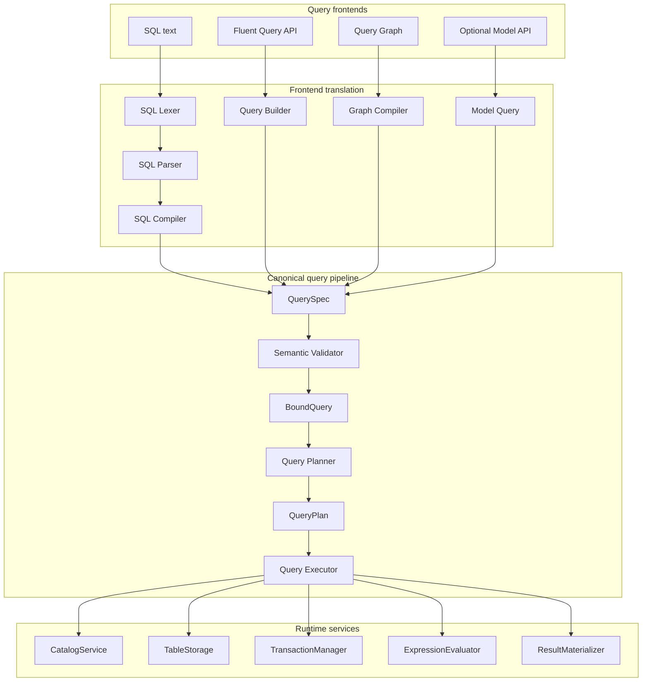

# GDSQL Canonical Query Architecture

## Purpose

The redesigned GDSQL architecture establishes a clear separation between:

- The interfaces used to describe database operations.
- The internal representation of those operations.
- Validation and planning.
- Query execution.
- Catalog metadata.
- Physical storage.
- Result presentation.
- Editor tooling.

The core architectural principle is that every query frontend produces the same canonical representation.



The intended dependency direction is:

```text
Frontend input
    ↓
Frontend-specific translator
    ↓
QuerySpec
    ↓
Semantic validation and binding
    ↓
QueryPlan
    ↓
QueryExecutor
    ↓
Catalog and storage contracts
    ↓
ConfigFile / .cfg implementation
```

---

## 1. `QuerySpec`

`QuerySpec` is a typed, frontend-independent description of a requested database operation.

It answers:

> What operation has been requested?

It represents query meaning without defining how the operation will be executed.

The following inputs should be capable of producing equivalent `QuerySpec` objects:

```text
SQL text
Fluent Query API
Query Graph
Optional model or repository API
```

For example:

```sql
SELECT name, health
FROM heroes
WHERE health > 100
ORDER BY health DESC
LIMIT 10;
```

may be represented as:

```gdscript
var query := SelectQuerySpec.new()

query.source = TableReference.new(&"heroes")
query.projections = [
    SelectProjection.new(
        ColumnExpression.new(&"name")
    ),
    SelectProjection.new(
        ColumnExpression.new(&"health")
    ),
]
query.predicate = ComparisonExpression.new(
    ColumnExpression.new(&"health"),
    ComparisonOperator.GREATER_THAN,
    LiteralExpression.new(100)
)
query.ordering = [
    OrderClause.new(
        ColumnExpression.new(&"health"),
        SortDirection.DESCENDING
    )
]
query.limit = 10
```

The representation describes the requested operation but does not access table files, iterate rows, or persist data.

---

## 2. `QuerySpec` containment

`QuerySpec` contains query meaning rather than runtime infrastructure.

Its contents may include:

- Query operation type.
- Source tables.
- Selected expressions.
- Predicates.
- Join definitions.
- Grouping expressions.
- Ordering clauses.
- Inserted values.
- Update assignments.
- Limits and offsets.

Runtime infrastructure remains outside the canonical model:

- Storage sessions.
- `ConfigFile` instances.
- File paths.
- Loaded rows.
- Transaction state.
- Editor controls.
- Workbench services.
- Query execution state.
- Cached query plans.
- Persistence callbacks.

The preferred flow is:

```gdscript
var query: QuerySpec = frontend.compile(input)
var validation := validator.validate(query)
var plan := planner.create_plan(validation.bound_query)
var execution := executor.execute(plan)
```

A `QuerySpec` is treated as descriptive data rather than an executable object.

---

## 3. Query model hierarchy

Godot 4.5 abstract classes and methods provide explicit contracts for the redesigned architecture.

Adopting `@abstract` makes Godot 4.5 the minimum supported version unless a compatibility layer is maintained.

```gdscript
@abstract
class_name QuerySpec
extends RefCounted

enum Operation {
    SELECT,
    INSERT,
    UPDATE,
    DELETE,
}

var operation: Operation

@abstract
func accept(visitor: QuerySpecVisitor) -> Variant
```

Concrete query types expose only the information relevant to their operation.

### Select

```gdscript
class_name SelectQuerySpec
extends QuerySpec

var source: QuerySource
var projections: Array[SelectProjection] = []
var joins: Array[JoinSpec] = []
var predicate: QueryExpression
var grouping: Array[QueryExpression] = []
var having: QueryExpression
var ordering: Array[OrderClause] = []
var limit: int = -1
var offset: int = 0
var distinct: bool = false

func _init() -> void:
    operation = Operation.SELECT

func accept(visitor: QuerySpecVisitor) -> Variant:
    return visitor.visit_select(self)
```

`SelectProjection` associates an output expression with an optional result
alias. The alias belongs to the selected output item rather than to the
expression itself, allowing expressions to remain reusable in predicates,
ordering, grouping, and updates.

### Insert

```gdscript
class_name InsertQuerySpec
extends QuerySpec

var target: TableReference
var columns: Array[StringName] = []
var rows: Array[InsertRow] = []

func _init() -> void:
    operation = Operation.INSERT

func accept(visitor: QuerySpecVisitor) -> Variant:
    return visitor.visit_insert(self)
```

### Update

```gdscript
class_name UpdateQuerySpec
extends QuerySpec

var target: TableReference
var assignments: Array[ColumnAssignment] = []
var predicate: QueryExpression

func _init() -> void:
    operation = Operation.UPDATE

func accept(visitor: QuerySpecVisitor) -> Variant:
    return visitor.visit_update(self)
```

### Delete

```gdscript
class_name DeleteQuerySpec
extends QuerySpec

var target: TableReference
var predicate: QueryExpression

func _init() -> void:
    operation = Operation.DELETE

func accept(visitor: QuerySpecVisitor) -> Variant:
    return visitor.visit_delete(self)
```

The visitor mechanism allows validators, planners, serializers, and diagnostic tools to handle each concrete query type through a common entry point.

It remains an implementation choice rather than a mandatory pattern. Direct typed methods may replace visitors when they provide a simpler design.

---

## 4. Canonical expression model

Filters, calculated values, join conditions, grouping expressions, and ordering expressions use a shared expression model.

The following expression:

```sql
health > 100 AND class = 'mage'
```

should have one canonical representation regardless of whether it originated from SQL, the fluent API, or a graph.

```gdscript
@abstract
class_name QueryExpression
extends RefCounted

@abstract
func accept(visitor: ExpressionVisitor) -> Variant
```

### Column reference

```gdscript
class_name ColumnExpression
extends QueryExpression

var table_alias: StringName
var column_name: StringName

func _init(
    p_column_name: StringName,
    p_table_alias: StringName = &""
) -> void:
    column_name = p_column_name
    table_alias = p_table_alias

func accept(visitor: ExpressionVisitor) -> Variant:
    return visitor.visit_column(self)
```

### Literal value

```gdscript
class_name LiteralExpression
extends QueryExpression

var value: Variant

func _init(p_value: Variant) -> void:
    value = p_value

func accept(visitor: ExpressionVisitor) -> Variant:
    return visitor.visit_literal(self)
```

### Comparison

```gdscript
class_name ComparisonExpression
extends QueryExpression

var left: QueryExpression
var operator: ComparisonOperator
var right: QueryExpression

func accept(visitor: ExpressionVisitor) -> Variant:
    return visitor.visit_comparison(self)
```

### Logical composition

```gdscript
class_name LogicalExpression
extends QueryExpression

var left: QueryExpression
var operator: LogicalOperator
var right: QueryExpression

func accept(visitor: ExpressionVisitor) -> Variant:
    return visitor.visit_logical(self)
```

### Scalar expression semantics

The canonical scalar model also includes:

- `ArithmeticExpression` for numeric arithmetic and string addition.
- `NullCheckExpression` for explicit `IS NULL` and `IS NOT NULL` checks.
- `FunctionExpression` for registered scalar or aggregate calls.

Scalar evaluation follows SQL-like null propagation. Arithmetic and ordinary
comparisons return `null` when an operand is `null`; predicates treat that
unknown result as non-matching. Logical expressions use three-valued `AND`,
`OR`, and `NOT` semantics. Explicit null checks always return a boolean.

The query-level function catalog exposes definitions containing name, arity,
return type, and aggregate classification. Validation depends on this metadata,
while the execution-level registry owns the matching scalar and aggregate
callables. The initial runtime provides `lower`, `upper`, `length`, `abs`,
`coalesce`, `count`, `sum`, `avg`, `min`, and `max`. Function existence,
arity, argument compatibility, expression type compatibility, aggregate
placement, and grouped-expression compatibility are validated before planning.
Aggregate execution groups rows before HAVING, ordering, and projection.

Expression objects describe meaning. Evaluation is performed separately:

```gdscript
var matches := expression_evaluator.evaluate(
    expression,
    row_context
)
```

This separation allows expressions to be:

- Validated before execution.
- Displayed in the graph editor.
- Included in diagnostics.
- Serialized for debugging.
- Evaluated against different row representations.
- Translated into native operations later.

### 4.1 Typed expression convenience frontend

`GDSQLExpr` is the code-facing convenience frontend over the canonical
expression classes. It directly creates the existing typed expression nodes,
while fluent
combinators on `GDSQLQueryExpression` remove constructor and enum repetition:

```gdscript
GDSQLExpr.column(&"level").add(1)
GDSQLExpr.column(&"health").greater_than(100)
GDSQLExpr.column(&"name").equals("Mage")
GDSQLExpr.and_(condition_a, condition_b)
```

Operands may also be expressions, allowing calculations between columns:

```gdscript
GDSQLExpr.column(&"damage").add(GDSQLExpr.column(&"bonus"))
```

The factories are:

- `column(column_name, table_alias)` for an optionally qualified column.
- `literal(value)` for an explicit literal.
- `and_(left, right)`, `or_(left, right)`, and `not_(expression)` for logical
  composition.
- `scalar(name, arguments)` and `aggregate(name, arguments)` for function
  expressions.

Every canonical expression supports comparison combinators (`equals()`,
`not_equals()`, `greater_than()`, `less_than()`, and their inclusive forms),
arithmetic combinators (`add()`, `subtract()`, `multiply()`, `divide()`, and
`modulo()`), logical chaining, and `is_null()` / `is_not_null()` checks. Each
combinator creates a new expression node and leaves its receiver unchanged.

Literal coercion is explicit in the helper implementation: an operand that is
already a `GDSQLQueryExpression` is preserved, while any other `Variant`, such
as `1`, `null`, or `"Mage"`, becomes a `GDSQLLiteralExpression`. A string passed
to `equals()` or a function argument represents data. SQL expression strings
enter through the SQL compiler. The graph frontend can construct the same typed
nodes and later render them as copyable `GDSQLExpr` GDScript.

An expression-based update remains compact and follows the canonical query
pipeline:

```gdscript
database.table(&"heroes") \
    .update() \
    .set_expression(&"level", GDSQLExpr.column(&"level").add(1)) \
    .where(GDSQLExpr.column(&"id").equals(hero_id)) \
    .build()
```

---

## 5. SQL lexer

The lexer converts SQL source text into tokens.

```text
Input:
SELECT name FROM heroes WHERE health >= 100

Output:
KEYWORD_SELECT
IDENTIFIER("name")
KEYWORD_FROM
IDENTIFIER("heroes")
KEYWORD_WHERE
IDENTIFIER("health")
GREATER_THAN_OR_EQUAL
NUMBER_LITERAL(100)
END_OF_INPUT
```

```gdscript
@abstract
class_name SqlLexer
extends RefCounted

@abstract
func tokenize(source: String) -> TokenizationResult
```

```gdscript
class_name TokenizationResult
extends RefCounted

var tokens: Array[SqlToken] = []
var diagnostics: Array[QueryDiagnostic] = []

func is_successful() -> bool:
    return diagnostics.is_empty()
```

The lexer recognizes:

- Keywords.
- Identifiers.
- Literals.
- Operators.
- Separators.
- Comments.
- Quoted names.
- Source positions.

Its input is text and its output is token data. Catalog lookup, query execution, and editor presentation remain outside this layer.

---

## 6. SQL parser

The parser converts tokens into a SQL syntax tree.

```gdscript
@abstract
class_name SqlParser
extends RefCounted

@abstract
func parse(tokens: Array[SqlToken]) -> SqlParseResult
```

The parser owns SQL grammar, including:

- Statement structure.
- Clause placement.
- Join syntax.
- Operator precedence.
- Parenthesized expressions.
- Function calls.
- Aliases.
- Grouping.
- Ordering.
- Limits and offsets.

For example:

```sql
SELECT name
FROM heroes
WHERE health > 100;
```

may produce:

```text
SqlSelectStatement
├── projections
│   └── SqlColumnNode("name")
├── source
│   └── SqlTableNode("heroes")
└── where_clause
    └── SqlBinaryExpressionNode
        ├── SqlColumnNode("health")
        ├── GREATER_THAN
        └── SqlLiteralNode(100)
```

The syntax tree may preserve SQL-specific information:

- Token positions.
- Original aliases.
- Parentheses.
- Keyword forms.
- Source spans.
- Parse-recovery information.

```gdscript
class_name SqlParseResult
extends RefCounted

var statement: SqlStatement
var diagnostics: Array[QueryDiagnostic] = []

func is_successful() -> bool:
    return statement != null and diagnostics.is_empty()
```

Diagnostics are returned as data. The editor determines how they are displayed.

---

## 7. SQL compilation

The SQL AST and `QuerySpec` represent different domains.

```text
SQL AST
    Represents SQL syntax.

QuerySpec
    Represents canonical query meaning.
```

A compiler translates between them.

```gdscript
@abstract
class_name SqlQueryCompiler
extends RefCounted

@abstract
func compile(
    statement: SqlStatement
) -> QueryCompilationResult
```

```gdscript
func compile_select(
    statement: SqlSelectStatement
) -> QueryCompilationResult:
    var query := SelectQuerySpec.new()

    query.source = _compile_source(statement.source)
    query.projections = _compile_projections(
        statement.projections
    )
    query.joins = _compile_joins(statement.joins)
    query.predicate = _compile_expression(
        statement.where_clause
    )
    query.grouping = _compile_expressions(
        statement.group_by
    )
    query.having = _compile_expression(statement.having)
    query.ordering = _compile_ordering(
        statement.order_by
    )
    query.limit = statement.limit
    query.offset = statement.offset

    return QueryCompilationResult.success(query)
```

Each frontend ends at the canonical model:

```text
SQL frontend:
SQL text → tokens → SQL AST → QuerySpec

Graph frontend:
Graph model → QuerySpec

Fluent API:
Builder state → QuerySpec

Model API:
Model operation → QuerySpec
```

Input-specific concerns end at `QuerySpec`.

---

## 8. Semantic validation

The parser determines whether SQL follows the grammar.

The semantic validator determines whether the query is meaningful within the database catalog.

```sql
SELECT unknown_column
FROM heroes;
```

This statement may be syntactically valid while remaining semantically invalid.

```gdscript
@abstract
class_name QueryValidator
extends RefCounted

@abstract
func validate(
    query: QuerySpec,
    catalog: CatalogSnapshot
) -> QueryValidationResult
```

The catalog may instead be injected as a stable constructor dependency:

```gdscript
class_name DefaultQueryValidator
extends QueryValidator

var _catalog: CatalogService

func _init(catalog: CatalogService) -> void:
    _catalog = catalog

func validate(
    query: QuerySpec
) -> QueryValidationResult:
    return _validate_against(
        query,
        _catalog.create_snapshot()
    )
```

Validation includes:

- Database and table existence.
- Column resolution.
- Alias resolution.
- Expression type compatibility.
- Aggregate usage.
- Insert value compatibility.
- Required columns.
- Primary-key restrictions.
- Valid limits and offsets.
- Function existence and arguments.
- Join source validity.

Diagnostics use a typed representation:

```gdscript
class_name QueryDiagnostic
extends RefCounted

enum Severity {
    INFO,
    WARNING,
    ERROR,
}

var code: StringName
var severity: Severity
var message: String
var source_span: SourceSpan
var related_object: Variant
```

Each diagnostic belongs to the stage that produced it.

---

## 9. Binding

A raw query may contain unresolved names:

```gdscript
ColumnExpression.new(&"health")
```

Binding resolves those names against the catalog:

```text
BoundColumnExpression
├── table_id: TableId("game", "heroes")
├── column_id: ColumnId("health")
└── data_type: TYPE_INT
```

Multi-source binding resolves every table reference into a
`BoundTableSource`, preserving its alias and whether an outer join can make its
columns nullable. Join conditions are bound after the new source is added, so
they may reference the new table and any source introduced before it.

Unqualified columns are accepted only when exactly one visible source contains
that name. A duplicate column name across sources produces an ambiguous-column
diagnostic and requires qualification. Bound expressions use stable table IDs
plus a source qualifier, allowing separate occurrences of the same table in a
self-join to remain distinguishable during execution.

```gdscript
class_name BoundQuery
extends RefCounted

var source_query: QuerySpec
var root_operation: BoundQueryOperation
var referenced_tables: Array[TableDefinition] = []
var output_schema: ResultSchema
```

The distinction is:

```text
QuerySpec
    Canonical query meaning.
    May contain unresolved names.

BoundQuery
    Catalog-resolved and type-checked query.
    Ready for planning.
```

Binding may initially be implemented as part of validation, while retaining a separate conceptual boundary.

---

## 10. Query planning

The planner converts a validated query into executable operations.

```text
QuerySpec:
What data operation was requested?

QueryPlan:
Which runtime operations will perform it?
```

Example plan:

```text
Limit(10)
└── Distinct
    └── Project(name AS display_name, health)
        └── Sort(health DESC)
            └── Filter(health > 100)
                └── TableScan(heroes)
```

```gdscript
@abstract
class_name PlanNode
extends RefCounted

var output_schema: ResultSchema

@abstract
func accept(visitor: PlanNodeVisitor) -> Variant
```

```gdscript
class_name TableScanPlan
extends PlanNode

var table: TableDefinition
var alias: StringName

func accept(visitor: PlanNodeVisitor) -> Variant:
    return visitor.visit_table_scan(self)
```

```gdscript
class_name FilterPlan
extends PlanNode

var input: PlanNode
var predicate: QueryExpression

func accept(visitor: PlanNodeVisitor) -> Variant:
    return visitor.visit_filter(self)
```

```gdscript
class_name SortPlan
extends PlanNode

var input: PlanNode
var ordering: Array[OrderClause]

func accept(visitor: PlanNodeVisitor) -> Variant:
    return visitor.visit_sort(self)
```

```gdscript
class_name LimitPlan
extends PlanNode

var input: PlanNode
var limit: int
var offset: int

func accept(visitor: PlanNodeVisitor) -> Variant:
    return visitor.visit_limit(self)
```

The first planner may produce deterministic plans without cost estimation.
Ordering is applied to source rows before projection so a query may order by a
source column that is not returned. Projection establishes public output names
and the result schema. Distinct selection removes duplicate projected rows
before limit and offset are applied.

```gdscript
func plan_select(
    query: BoundSelectQuery
) -> QueryPlan:
    var current: PlanNode = TableScanPlan.new(
        query.source
    )

    if query.predicate != null:
        current = FilterPlan.new(
            current,
            query.predicate
        )

    if not query.grouping.is_empty() or query.has_aggregates():
        current = AggregatePlan.new(
            current,
            query.grouping,
            query.aggregate_expressions
        )

    if query.having != null:
        current = FilterPlan.new(
            current,
            query.having
        )

    if not query.ordering.is_empty():
        current = SortPlan.new(
            current,
            query.ordering
        )

    current = ProjectionPlan.new(
        current,
        query.projections
    )

    if query.distinct:
        current = DistinctPlan.new(current)

    if query.limit >= 0 or query.offset > 0:
        current = LimitPlan.new(
            current,
            query.limit,
            query.offset
        )

    return QueryPlan.new(current)
```

Later implementations may choose among alternative operations:

```text
TableScanPlan
PrimaryKeyLookupPlan
IndexLookupPlan
NestedLoopJoinPlan
HashJoinPlan
```

The selected plan may depend on:

- Available indexes.
- Table size.
- Query predicates.
- Storage capabilities.
- Cached metadata.
- Backend implementation.

These decisions do not alter `QuerySpec`.

### 10.1 Indexes and storage capabilities

Indexes are an execution and storage capability rather than a second query
model. `IndexDefinition` stores a stable name, an ordered column list, and a
uniqueness policy in catalog metadata. `StorageCapabilities` reports exact and
range lookup support without making the planner depend on a concrete backend.

The deterministic planner chooses among table scan, primary-key lookup, exact
index lookup, and range lookup based on bound predicates, index metadata, and
reported storage capabilities. The initial optimization recognizes literal
comparisons against single-column indexes, including indexed comparisons inside
an `AND` predicate. It retains the complete predicate as a filter after the
lookup, preserving semantics when other conditions are present. Composite
indexes are represented and enforce uniqueness, while composite lookup-prefix
planning remains a later optimization.

Storage owns index maintenance and lookup execution. ConfigFile storage keeps
index entries in reserved table sections that associate indexed values with
primary-key sections. Entries are rebuilt as part of the same commit that
persists row mutations. A backend that reports no index support remains valid
and receives scan-based plans.

The initial join planner emits deterministic `NestedLoopJoinPlan` nodes in the
same order as the canonical join clauses. `INNER` and `LEFT` joins are
executable. `RIGHT` and `FULL` remain represented by `JoinSpec`, but validation
returns a structured unsupported diagnostic until the corresponding unmatched
row propagation is implemented.

Joined intermediate rows retain source-qualified values for bound expression
evaluation. Explicit projections determine public output names. When a joined
query omits projections, the binder expands all source columns using
`qualifier.column` names to avoid collisions.

---

## 11. Query execution

The executor follows a `QueryPlan`.

```gdscript
@abstract
class_name QueryExecutor
extends RefCounted

@abstract
func execute(
    plan: QueryPlan,
    context: ExecutionContext
) -> QueryExecutionResult
```

```gdscript
class_name ExecutionContext
extends RefCounted

var catalog: CatalogService
var storage: TableStorage
var transactions: TransactionManager
var expression_evaluator: ExpressionEvaluator
var function_registry: QueryFunctionRegistry
var cancellation: QueryCancellationToken
var session: StorageSession
```

The executor may:

- Read table snapshots.
- Iterate rows.
- Evaluate predicates.
- Perform joins.
- Group rows.
- Calculate aggregates.
- Sort intermediate results.
- Apply limits and offsets.
- Stage mutations.
- Commit or roll back transactions.
- Produce execution statistics.
- Return an internal row set.

The executor operates on plans and runtime services. SQL syntax, graph nodes, editor controls, and physical file paths remain outside its responsibilities.

The initial mutation slice supports single-table `INSERT`, `UPDATE`, and
`DELETE`. Update assignments and mutation predicates are validated and bound
before planning. Execution reads matching rows, stages changes through
`TableStorage`, and commits once per query. Mutation results report affected
row counts and include the inserted, updated, or deleted rows. Updating a
primary key is intentionally rejected by the initial implementation.
ConfigFile storage validates primary-key and column-level unique constraints
against the final staged table state before persistence. A violation rolls back
the entire query, including multi-row inserts and updates. Nullable unique
columns permit multiple null values. Insert validation applies declared static
defaults, including an explicitly declared null default.

Integer primary keys may declare `auto_increment`. The ConfigFile backend owns
the mutable sequence and row count in a reserved table-file metadata section:

```ini
[__gdsql_metadata__]
row_count=42
next_auto_increment=58
```

Generated keys are reserved in the storage session and persisted only when the
mutation commits. Deletion reduces `row_count` but does not reduce or reuse the
sequence. An explicit key at or above the current sequence advances the next
generated value. If table metadata is absent or damaged, the storage backend
may derive a replacement high-water mark from the existing rows.

### 11.1 Callback-scoped transactions

Explicit multi-statement transactions are planned as a callback API:

```gdscript
database.transaction(
    func(transaction: GDSQLTransaction) -> void:
        transaction.execute(first_query)
        transaction.execute(second_query)
)
```

All callback executions share one storage session. Leaving the callback commits
only when every execution succeeded; otherwise the runtime rolls back. The
transaction object cannot be reused after the callback and reads inside the
callback must observe earlier staged writes. This avoids abandoned transactions
and preserves ordinary `execute()` as an automatically committed operation.

`Database.transaction()` returns an `OperationResult`. A statement-level
validation, planning, execution, or staging error marks the scope as failed and
prevents later statements from executing. Constraints that require the complete
staged database state are validated during the final commit. A commit failure
also rolls back the shared session and is returned through structured
diagnostics.

#### Capturing statement results

Most callers only need the transaction-level result because the scope records
any failed statement automatically:

```gdscript
var result := database.transaction(
    func(transaction: GDSQLTransaction) -> void:
        transaction.execute(first_query)
        transaction.execute(second_query)
)
```

When individual query results are needed after the callback, they must be
stored in a shared mutable container. GDScript lambdas capture a local variable
slot by value. Reassigning that captured slot does not reassign the outer local
variable, even when its declared type is `GDSQLQueryResult`:

```gdscript
var first_result: GDSQLQueryResult

database.transaction(
    func(transaction: GDSQLTransaction) -> void:
        # Rebinds the lambda's captured slot; first_result remains null outside.
        first_result = transaction.execute(first_query)
)
```

A typed array is the recommended representation for an ordered collection of
statement results. Both scopes refer to the same Array object, and `append()`
mutates that object:

```gdscript
var statement_results: Array[GDSQLQueryResult] = []

var result := database.transaction(
    func(transaction: GDSQLTransaction) -> void:
        statement_results.append(transaction.execute(first_query))
        statement_results.append(transaction.execute(second_query))
)
```

A dictionary is useful when each result has a distinct meaning and named access
is clearer than positional access:

```gdscript
var statement_results := {
    "inventory": null,
    "quest": null,
}

var result := database.transaction(
    func(transaction: GDSQLTransaction) -> void:
        statement_results.inventory = transaction.execute(inventory_query)
        statement_results.quest = transaction.execute(quest_query)
)
```

The container choice is not relevant to database performance. An isolated
Godot 4.7 microbenchmark that created one callback and captured two values per
iteration found the typed array fastest, with dictionary capture approximately
1.36 times its cost and a newly allocated typed holder approximately 1.67 times
its cost. That difference was below one microsecond per callback on the measured
machine. When the same two strategies executed two real statements and one
ConfigFile commit, their elapsed times differed by less than one percent and
changed order between runs.

These measurements are illustrative rather than an API guarantee. Query
validation, planning, row work, and storage persistence dominate the operation.
Choose a typed array for ordered results and a dictionary or typed holder when
named access materially improves readability. Timing assertions do not belong
in the behavioral transaction test suite because they would be
platform-dependent and flaky.

### 11.2 Database registry

`GDSQLDatabaseRegistry` keeps open `GDSQLDatabase` handles under registration
names. Logical roles point to those registrations:

```gdscript
var registry := GDSQLDatabaseRegistry.new()
registry.register(&"base_content", content_database)
registry.register(&"slot_1", save_database)
registry.bind_role(GDSQLDatabaseRegistry.CONTENT_ROLE, &"base_content")
registry.bind_role(GDSQLDatabaseRegistry.SAVE_ROLE, &"slot_1")

var active_save := registry.resolve_role(
    GDSQLDatabaseRegistry.SAVE_ROLE,
).get_database()
```

Binding a role again selects another registered handle. This supports active
save selection, effective-content replacement, settings, analytics, and
project-defined roles through one API. Unregistering a handle also clears each
role that selected it. Every lifecycle and resolution operation returns a
`GDSQLDatabaseResult` with structured diagnostics.

Durable registration metadata uses `GDSQLDatabaseRegistration` and
`GDSQLDatabaseRegistrySnapshot`. `GDSQLConfigFileDatabaseRegistryStore` stores
the snapshot in `user://gdsql/databases.cfg`, allowing runtime startup and
editor tools to inspect database roots, backend types, and role selections.
Open handles remain attached to the active application context.

### 11.3 Persistence semantics and checkpoints

A transaction commit establishes valid, visible database state. A checkpoint
transfers committed dirty state to durable storage. ConfigFile storage performs
durable work during commit. In-memory storage commits authoritative rows to
memory and records a dirty version for every affected table.

`GDSQLCheckpointTarget` exposes `is_dirty()` and `checkpoint()`.
`GDSQLPersistenceCoordinator` associates targets with typed policies and
coordinates explicit, dirty-set, and immediate post-commit checkpoints:

```gdscript
var persistence := GDSQLPersistenceCoordinator.new()
persistence.register(
    &"save_1",
    buffered_save_storage,
    GDSQLCheckpointPolicy.periodic(30.0),
)

var result := persistence.checkpoint(&"save_1")
```

`GDSQLCheckpointResult` records databases that reached durable storage and
databases that remain dirty for a later retry. Periodic scheduling and graceful
shutdown integration belong to the optional runtime Node adapter.

`GDSQLInMemoryCheckpointTarget` composes an `InMemoryTableStorage` source with
an injected durable `TableStorage`. It synchronizes authoritative dirty tables
and clears a dirty marker only when the copied version remains current. This
adapter keeps checkpoint policy outside storage and keeps ConfigFile knowledge
outside the in-memory backend. `load_table()` establishes a clean authoritative
memory snapshot before runtime mutation when an existing durable dataset is
used as the source.

---

## 12. Storage boundary

The query runtime depends on an abstract storage contract.

```gdscript
@abstract
class_name TableStorage
extends RefCounted

@abstract
func read_table(
    table: TableDefinition,
    session: StorageSession
) -> TableSnapshot

@abstract
func find_by_primary_key(
    table: TableDefinition,
    key: Variant,
    session: StorageSession
) -> RowRecord

@abstract
func stage_insert(
    table: TableDefinition,
    row: RowRecord,
    session: StorageSession
) -> StorageOperationResult

@abstract
func stage_update(
    table: TableDefinition,
    key: Variant,
    row: RowRecord,
    session: StorageSession
) -> StorageOperationResult

@abstract
func stage_delete(
    table: TableDefinition,
    key: Variant,
    session: StorageSession
) -> StorageOperationResult

@abstract
func commit(
    session: StorageSession
) -> StorageCommitResult

@abstract
func rollback(session: StorageSession) -> void
```

The ConfigFile implementation owns knowledge of:

- `.cfg` files.
- Table file paths.
- Section names.
- Primary-key-to-section mapping.
- `ConfigFile`.
- Godot `Variant` serialization.
- Resource serialization.
- Dirty state.
- Persistence.

```gdscript
class_name ConfigFileTableStorage
extends TableStorage

var _path_resolver: DatabasePathResolver
var _config_cache: ConfigFileCache
var _codec: GodotVariantCodec

func _init(
    path_resolver: DatabasePathResolver,
    config_cache: ConfigFileCache,
    codec: GodotVariantCodec
) -> void:
    _path_resolver = path_resolver
    _config_cache = config_cache
    _codec = codec
```

The containment boundary is:

```text
QueryExecutor
    depends on TableStorage.

ConfigFileTableStorage
    depends on ConfigFile, .cfg paths, codecs, and persistence.
```

Storage representations do not propagate upward into the canonical query model.

A future `GDSQLPagedBinaryTableStorage` can implement the same contract with
one binary file per table. Each file begins with a typed header containing the
format version, schema fingerprint, page size, row count, generated-key state,
and root page references for rows and indexes. Independently addressable pages
allow targeted row and index loading while preserving the current table-level
file organization.

---

## 13. Catalog boundary

The catalog represents database structure rather than database rows.

```gdscript
@abstract
class_name CatalogService
extends RefCounted

@abstract
func get_database(
    database_name: StringName
) -> DatabaseDefinition

@abstract
func get_table(
    database_name: StringName,
    table_name: StringName
) -> TableDefinition

@abstract
func has_table(
    database_name: StringName,
    table_name: StringName
) -> bool

@abstract
func create_snapshot() -> CatalogSnapshot
```

The catalog owns:

- Database definitions.
- Table definitions.
- Column definitions.
- Primary keys.
- Index definitions.
- Default values.
- Nullability.
- Uniqueness.
- Auto-increment behavior.
- Configured data locations.

Catalog definitions are typed domain objects:

```gdscript
class_name DatabaseDefinition
extends RefCounted

var name: StringName
var tables: Array[TableDefinition] = []
```

```gdscript
class_name TableDefinition
extends RefCounted

var name: StringName
var columns: Array[ColumnDefinition] = []
var primary_key: StringName
var indexes: Array[IndexDefinition] = []
```

```gdscript
class_name ColumnDefinition
extends RefCounted

enum Generation {
	NONE,
	CREATED_AT,
	UPDATED_AT,
	# This policy boundary is going to allow UUID generation and more
	# storage-independent generated values.
}

var name: StringName
var data_type: Variant.Type
var nullable: bool
var unique: bool
var auto_increment: bool
var default: ColumnDefault
var generation: Generation
```

`ColumnDefault` distinguishes no default (`default == null`) from an explicitly
declared null default (`default.value == null`) without adding a second boolean
that can disagree with the value. Static defaults remain schema metadata.
The component also gives defaults an independent extension point for future
default metadata or policies without adding parallel state to
`ColumnDefinition`; generated values remain a separate concern.
Generated-value policies describe runtime behavior without embedding generators
inside the catalog model. `created_at()` and `updated_at()` provide the initial
timestamp policies, while `TableDefinition.add_timestamps()` adds both common
columns. Both values use one Unix-millisecond timestamp per mutation statement:
`created_at` is generated on insert, and `updated_at` is generated on insert and
update. Callers cannot assign generated timestamp columns directly. Adding one
to a populated table backfills existing rows with one alteration timestamp.
Mutable row counts and generated-key sequences remain owned by physical storage.

Rows and query execution remain outside the catalog.

A lightweight table-version field may later be added to schema metadata for
game code to detect incompatible saved data. A general migration framework is
outside the current scope.

### 13.1 Catalog administration

Catalog reads and catalog mutations use separate contracts. Query validation,
binding, planning, and execution depend only on `CatalogService`; they cannot
create or alter structure. Code-facing structure management enters through
`Database` and is delegated by `DatabaseContext` to
`CatalogAdministrationService`.

```gdscript
@abstract
class_name CatalogAdministrationService
extends RefCounted

@abstract
func create_database(database_name: StringName) -> CatalogOperationResult

@abstract
func rename_database(current_name: StringName, new_name: StringName) -> CatalogOperationResult

@abstract
func drop_database(database_name: StringName) -> CatalogOperationResult

@abstract
func create_table(
    database_name: StringName,
    table: TableDefinition,
) -> CatalogOperationResult

@abstract
func rename_table(database_name: StringName, current_name: StringName, new_name: StringName) -> CatalogOperationResult

@abstract
func alter_table(
    database_name: StringName,
    table_name: StringName,
    alterations: Array[TableAlteration],
) -> CatalogOperationResult

@abstract
func drop_table(database_name: StringName, table_name: StringName) -> CatalogOperationResult
```

The public API accepts typed `TableDefinition` and `ColumnDefinition` objects.
It does not accept ConfigFile sections or construct project paths. The concrete
ConfigFile administration service lives in `storage/configfile`, receives a
`DatabasePathResolver` through its constructor, and owns creation of database
registrations, workspace directories, and schema files.

Catalog mutations return `CatalogOperationResult` with structured diagnostics
for invalid definitions, duplicate objects, unreadable catalogs, and failed
persistence. Ordinary catalog failures are not printed or thrown.

Database creation establishes the project-owned structure described in section
17.1. Table creation persists both schema metadata and an empty backend table
file, so a successful operation leaves a complete, immediately usable table.
Row contents and later mutations remain owned by `TableStorage`. The ConfigFile
backend may complete a missing empty table file when an existing stored schema
exactly matches the requested definition; this repairs incomplete structures
without overwriting a table or changing its schema.

Table alterations are explicit typed intents: add column, rename column, or
drop column. The backend updates schema and existing row files together. Adding
a non-nullable column to a populated table requires a compatible default;
renaming a column migrates stored row keys; dropping a column removes stored
values. Dropping the primary key is rejected. Database and table renames move
their complete physical structures and update catalog metadata, while drop
operations remove both metadata and owned storage.

---

## 14. Result materialization

Execution output and user-facing output are separate concerns.

The executor may produce:

```gdscript
class_name RowSet
extends RefCounted

var schema: ResultSchema
var rows: Array[RowRecord] = []
```

A materializer converts this representation into the requested result type.

```gdscript
@abstract
class_name ResultMaterializer
extends RefCounted

@abstract
func materialize(
    rows: RowSet,
    mapping: ResultMapping = null
) -> QueryResult
```

Possible materializers include:

```text
DictionaryResultMaterializer
ResourceResultMaterializer
ModelResultMaterializer
EditorTableMaterializer
CsvExportMaterializer
```

Specialized materializers can extend this boundary while the executor remains
row-oriented.

The initial materialization boundary is available after execution:

```gdscript
var mapping := GDSQLResultMapping.new() \
    .map_column(&"id", &"hero_id") \
    .map_column(&"name", &"display_name")

var materialized := query_result.materialize(
    GDSQLDictionaryResultMaterializer.new(),
    mapping,
)
var dictionaries: Array = materialized.get_value()
```

An empty mapping uses every result column with its existing name. Once mappings
are declared, they select source columns and define their output names.
`DictionaryResultMaterializer` creates one independent dictionary per row.
`ResourceResultMaterializer` requires a target script extending `Resource` and
assigns mapped result columns to existing Resource properties:

```gdscript
var mapping := GDSQLResultMapping.for_resource(HeroView) \
    .map_column(&"name", &"display_name")
```

Materialized objects are returned through `OperationResult.value`; the result
retains its schema, statistics, diagnostics, and source rows. Materializers
produce structured diagnostics for missing columns, duplicate output names,
missing Resource properties, and invalid Resource scripts. Execution remains
row-oriented and does not depend on dictionary or Resource presentation.

The executor does not need to know whether rows will be:

- Displayed in the editor.
- Returned as dictionaries.
- Converted to resources.
- Converted into model objects.
- Exported to CSV or JSON.

### 14.1 Model materialization and persisted-row operations

The model frontend will build on this boundary. A `GDSQLModel` represents one
materialized row and is associated through `GDSQLModelDefinition` with one
logical database and table. `GDSQLModelRegistry` resolves model definitions
and delegates logical role selection to `GDSQLDatabaseRegistry`, while
`GDSQLModelContext` permits isolated registries for tests. Model metadata stores
logical roles and table names.

Application composition configures the default model context once. Concrete
model classes provide thin static forwarding methods:

```gdscript
static func query() -> GDSQLModelQuery:
    return GDSQLModels.query(Hero)

static func find(identity: Variant) -> GDSQLQueryResult:
    return GDSQLModels.find(Hero, identity)
```

Normal queries remain model-scoped and omit infrastructure arguments:

```gdscript
Hero.query() \
    .where(GDSQLExpr.column(&"level").greater_than(3)) \
    .all()
```

`GDSQLModels` delegates to the configured context, which resolves `Hero` to its
registered logical role and table. The forwarding method passes `Hero`
explicitly because GDScript inherited static methods do not expose their
calling subclass. `all()` returns every materialized match.

Model materialization creates an Array whose runtime element type is the
concrete model script. Callers can retain typed property access directly:

```gdscript
var heroes: Array[Hero] = Hero.query().all().get_value()
```

Loaded `has_many` relationships use the related model script as their Array
element type in the same way.

Materialized models retain their context and original values. `refresh()`
reloads the row into the same object. Mutable models use changed-field UPDATEs
for `save()` and primary-key DELETEs for `delete()`. Content models return a
read-only diagnostic for mutation attempts. These helpers emit canonical query
specifications and remain independent from physical storage.
Typed relationship definitions live on model classes. Model queries use those
definitions for explicit or eager loading, and graphical tooling can inspect
the same keys to display related identifiers and records.

The model method is the source of truth for user-owned model scripts:

```gdscript
func relationships() -> Array[GDSQLRelationshipDefinition]:
    return [
        GDSQLRelationshipDefinition.has_many(
            &"skills",
            Skill,
            &"hero_id",
        ),
    ]
```

Registration captures and validates these definitions by relationship name.
`with(&"skills")` performs a separate batched model query through the related
model's logical role and attaches the result to each materialized model.
`get_related(&"skills")` returns the loaded model, model array, or null, while
`is_relationship_loaded(&"skills")` distinguishes an unloaded relationship
from an empty result. Early graphical tooling may inspect this metadata while
treating handwritten model code as read-only.

The catalog remains the sole authority for database and table structure.
`GDSQLModel` binds typed properties and high-level behavior to an existing
logical table; it does not provide table definitions or invoke catalog
administration. Tables remain valid without models, and multiple higher-level
frontends may consume the same catalog structure.

The graphical editor is a database and table viewer and manipulator. It depends
on catalog definitions, catalog administration, and canonical queries.
Registered models may provide optional materialization and relationship
conveniences, but the editor does not rewrite model scripts or derive catalog
mutations from them. Read-only model compatibility validation may report stale
properties after a table change.

---

## 15. Dependency injection

Architecturally significant dependencies are supplied through constructors or method parameters.

```gdscript
class_name DefaultQueryExecutor
extends QueryExecutor

var _storage: TableStorage
var _catalog: CatalogService
var _transactions: TransactionManager
var _expressions: ExpressionEvaluator

func _init(
    storage: TableStorage,
    catalog: CatalogService,
    transactions: TransactionManager,
    expressions: ExpressionEvaluator
) -> void:
    assert(storage != null)
    assert(catalog != null)
    assert(transactions != null)
    assert(expressions != null)

    _storage = storage
    _catalog = catalog
    _transactions = transactions
    _expressions = expressions
```

Stable dependencies belong in constructors.

Operation-specific dependencies may be supplied through method parameters:

```gdscript
func execute(
    plan: QueryPlan,
    cancellation: QueryCancellationToken
) -> QueryExecutionResult:
```

Mutable public dependency properties are avoided because they permit partially constructed objects.

### Composition root

Concrete implementations are assembled in one composition root.

```gdscript
class_name GDSQLRuntimeFactory
extends RefCounted

static func create_default(
    settings: GDSQLSettings
) -> DatabaseContext:
    var path_resolver := \
        DefaultDatabasePathResolver.new(settings)

    var config_cache := ConfigFileCache.new()
    var codec := GodotVariantCodec.new()

    var storage: TableStorage = \
        ConfigFileTableStorage.new(
            path_resolver,
            config_cache,
            codec
        )

    var catalog: CatalogService = \
        ConfigFileCatalogService.new(
            path_resolver,
            config_cache
        )

    var transactions: TransactionManager = \
        DefaultTransactionManager.new(storage)

    var expressions: ExpressionEvaluator = \
        DefaultExpressionEvaluator.new()

    var validator: QueryValidator = \
        DefaultQueryValidator.new(catalog)

    var planner: QueryPlanner = \
        DefaultQueryPlanner.new(catalog)

    var executor: QueryExecutor = \
        DefaultQueryExecutor.new(
            storage,
            catalog,
            transactions,
            expressions
        )

    return DatabaseContext.new(
        catalog,
        storage,
        validator,
        planner,
        executor
    )
```

The composition root is permitted to reference concrete implementations. Most other classes depend on abstract contracts.

This supports:

- Test substitutes.
- In-memory implementations.
- Alternative storage backends.
- Optional native implementations.
- Explicit ownership.
- Controlled construction.
- Fewer hidden dependencies.

---

## 16. Import and dependency rules

The permitted direction is:

```text
editor
    ↓
public runtime facade
    ↓
frontend translators
    ↓
canonical query model
    ↓
validation and binding
    ↓
planning
    ↓
execution
    ↓
catalog and storage abstractions
    ↓
ConfigFile backend
```

Examples of prohibited reverse dependencies:

```text
query/model
    must not import query/execution

storage
    must not import SqlParser

catalog
    must not import editor classes

runtime
    must not import WorkbenchManager

ConfigFileTableStorage
    must not import QueryBuilder

SqlParser
    must not import QueryExecutor

GraphCompiler
    must not import ConfigFileTableStorage
```

---

## 17. Proposed source layout

```text
addons/gdsql/
├── api/
│   ├── database.gd
│   ├── database_result.gd
│   ├── database_context.gd
│   ├── transaction.gd
│   ├── query.gd
│   ├── select_query_builder.gd
│   ├── insert_query_builder.gd
│   ├── update_query_builder.gd
│   ├── delete_query_builder.gd
│   └── query_result.gd
│
├── runtime/
│   ├── database_registry.gd
│   ├── database_registration.gd
│   ├── database_registry_store.gd
│   ├── checkpoint_target.gd
│   ├── checkpoint_policy.gd
│   ├── checkpoint_result.gd
│   ├── in_memory_checkpoint_target.gd
│   └── persistence_coordinator.gd
│
├── model/
│   ├── model.gd
│   ├── content_model.gd
│   ├── save_model.gd
│   ├── settings_model.gd
│   ├── model_access_mode.gd
│   ├── model_definition.gd
│   ├── relationship_definition.gd
│   ├── model_registry.gd
│   ├── model_context.gd
│   ├── models.gd
│   └── model_query.gd
│
├── query/
│   ├── model/
│   │   ├── query_spec.gd
│   │   ├── select_query_spec.gd
│   │   ├── insert_query_spec.gd
│   │   ├── update_query_spec.gd
│   │   ├── delete_query_spec.gd
│   │   ├── expressions/
│   │   └── clauses/             # Includes SelectProjection and OrderClause
│   │
│   ├── sql/
│   │   ├── lexer/
│   │   ├── parser/
│   │   ├── ast/
│   │   └── compiler/
│   │
│   ├── validation/
│   │   ├── query_validator.gd
│   │   └── default_query_validator.gd
│   │
│   ├── binding/
│   │   ├── bound_query.gd
│   │   ├── bound_select_query.gd
│   │   ├── bound_insert_query.gd
│   │   ├── bound_update_query.gd
│   │   ├── bound_delete_query.gd
│   │   └── bound_expression.gd
│   │
│   ├── planning/
│   │   ├── query_planner.gd
│   │   ├── query_plan.gd
│   │   └── nodes/              # Includes insert, update, and delete plans
│   │
│   └── execution/
│       ├── query_executor.gd
│       ├── default_query_executor.gd
│       ├── expression_evaluator.gd
│       └── operators/
│
├── catalog/
│   ├── catalog_service.gd
│   ├── catalog_administration_service.gd
│   ├── catalog_operation_result.gd
│   ├── database_definition.gd
│   ├── table_definition.gd
│   ├── table_alteration.gd
│   ├── column_definition.gd
│   └── index_definition.gd
│
├── storage/
│   ├── table_storage.gd
│   ├── storage_backend_ids.gd
│   ├── storage_session.gd
│   ├── table_snapshot.gd
│   ├── row_record.gd
│   ├── memory/
│   │   └── in_memory_table_storage.gd
│   └── configfile/
│       ├── config_file_table_storage.gd
│       ├── config_file_catalog_service.gd
│       ├── config_file_catalog_administration_service.gd
│       ├── config_file_database_registry_store.gd
│       ├── config_file_cache.gd
│       └── godot_variant_codec.gd
│
├── mapping/
│   ├── result_mapping.gd
│   ├── result_materializer.gd
│   └── materializers/
│
├── editor/
│   ├── workbench/
│   ├── sql_editor/
│   ├── query_graph/
│   └── table_editor/
│
└── common/
    ├── diagnostics/
    ├── identifiers/
    └── results/
```

Folders represent dependency boundaries rather than only user-facing features.

## 17.1 Project-owned runtime workspace

The plugin implementation and the project's database workspace are separate:

```text
res://
├── addons/
│   └── gdsql/                  # Plugin implementation only
├── .gdsql/
│   ├── settings.cfg            # Project/tool settings only
│   └── graphs/                 # Editor query graph documents
└── data/
    ├── databases.cfg           # Database catalog
    └── <database>/
        ├── schema/              # Table definitions
        └── tables/              # Row data stored as .cfg or binary table files
```

`.gdsql` is a hidden project configuration directory. It is not a second
plugin directory and must not contain runtime classes. The `data` directory is
project-owned database content. `DatabasePathResolver` and the ConfigFile
backend own the physical layout; query models, validators, planners, and
executors use logical catalog and table identifiers only.

Runtime placement and persistence policy are defined in
[`databases.md`](databases.md). The recommended game structure
keeps authored, read-only content under `res://data/` and mutable save state in
a separate database under `user://gdsql/saves/<save_name>/`. Shared user
settings belong outside individual save slots.

---

## 18. Editor containment

The editor depends on the runtime.

The runtime does not depend on the editor.

Database and table editing uses catalog definitions and
`CatalogAdministrationService`. Row editing uses canonical queries. Model
classes are optional result and code conveniences; they are not schema inputs,
editor documents, or catalog administration commands.

The editor owns decisions such as:

- Which panel displays diagnostics.
- Whether a query opens a new tab.
- Whether a result grid is refreshed.
- How progress is displayed.
- Whether query text is saved.
- How graph nodes are rendered.
- How database metadata appears in the workbench.

Runtime services return structured data and diagnostics.

```gdscript
func run_current_query() -> void:
    var result := sql_query_service.execute_text(
        code_editor.text
    )

    diagnostics_panel.display(result.diagnostics.entries)

    if result.is_successful():
        result_grid.display(result.rows)
```

No runtime class needs to reference the editor components used to display the result.

---

## 19. Error handling

Each pipeline stage returns structured results and diagnostics.

```gdscript
class_name Diagnostics
extends RefCounted

var entries: Array[QueryDiagnostic] = []

func is_successful() -> bool:
	for diagnostic in entries:
		if diagnostic.severity == \
				QueryDiagnostic.Severity.ERROR:
			return false

	return true

func print_to_debug(
	minimum_severity := QueryDiagnostic.Severity.ERROR
) -> void:
	for diagnostic in entries:
		if diagnostic.severity >= minimum_severity:
			print_debug(diagnostic.message)
```

Result types compose this component and delegate success inspection to it:

```gdscript
class_name OperationResult
extends RefCounted

var value: Variant
var diagnostics := Diagnostics.new()

func is_successful() -> bool:
	return diagnostics.is_successful()
```

Success inspection has no output side effects. Callers explicitly invoke
`print_to_debug()` when diagnostic reporting is desired and choose whether the
minimum included severity is `INFO`, `WARNING`, or `ERROR`.

More specific result types may include:

```text
DatabaseResult
TokenizationResult
SqlParseResult
QueryCompilationResult
QueryValidationResult
QueryBindingResult
QueryPlanningResult
QueryExecutionResult
StorageOperationResult
StorageCommitResult
```

Each stage reports errors from its own domain.

Examples:

```text
Lexer:
GDSQL_UNTERMINATED_STRING

Parser:
GDSQL_EXPECTED_FROM

Compiler:
GDSQL_UNSUPPORTED_SQL_CONSTRUCT

Validator:
GDSQL_UNKNOWN_COLUMN

Binder:
GDSQL_AMBIGUOUS_COLUMN

Planner:
GDSQL_UNSUPPORTED_PLAN

Executor:
GDSQL_EXPRESSION_EVALUATION_FAILED

Storage:
GDSQL_TABLE_FILE_UNREADABLE
```

Structured diagnostics make failure ownership visible to the editor, tests, contributors, and automated coding agents.

---

## 20. Controlled construction

GDScript does not provide immutable records, but query models can still follow controlled-construction conventions.

```gdscript
class_name SelectQueryBuilder
extends RefCounted

var _source: QuerySource
var _projections: Array[QueryExpression] = []
var _predicate: QueryExpression
var _ordering: Array[OrderClause] = []
var _limit: int = -1
var _built := false

func where(
    expression: QueryExpression
) -> SelectQueryBuilder:
    _ensure_not_built()
    _predicate = expression
    return self

func build() -> SelectQuerySpec:
    _ensure_not_built()
    _built = true

    var query := SelectQuerySpec.new()
    query.source = _source
    query.projections = _projections.duplicate()
    query.predicate = _predicate
    query.ordering = _ordering.duplicate()
    query.limit = _limit

    return query

func _ensure_not_built() -> void:
    assert(
        not _built,
        "Query builder cannot be modified after build()."
    )
```

The project-level convention is:

> Query models are constructed once and treated as immutable after compilation.

Private fields and getters may be used where stronger control is required.

---

## 21. Use of `Dictionary`

`Dictionary` remains appropriate where dynamic data is inherent:

- Reading serialized `.cfg` rows.
- Importing JSON.
- Handling arbitrary parameters.
- Interacting with `ConfigFile`.
- Returning compatibility-oriented results.
- Repairing or importing dynamic metadata.

Stable internal concepts use typed classes:

```gdscript
var query: SelectQuerySpec
var table: TableDefinition
var column: ColumnDefinition
var predicate: QueryExpression
var plan: QueryPlan
var row: RowRecord
```

Conversion occurs at boundaries:

```gdscript
var raw_values: Dictionary = config_file_reader.read(...)
var row: RowRecord = row_codec.decode(raw_values)
```

```gdscript
var stored_values: Dictionary = row_codec.encode(row)
```

---

## 22. Testing boundaries

Each layer is independently testable.

### Lexer

```gdscript
var result := lexer.tokenize(
    "SELECT name FROM heroes"
)

assert_true(result.is_successful())
assert_eq(result.tokens.size(), 5)
```

No catalog or files are required.

### Parser

```gdscript
var result := parser.parse(
    fixture_tokens_for_simple_select()
)

assert_true(
    result.statement is SqlSelectStatement
)
```

No executor is required.

### Compiler

```gdscript
var result := compiler.compile(
    fixture_select_ast()
)

assert_true(
    result.query is SelectQuerySpec
)
```

No storage is required.

### Validator

```gdscript
var catalog := FakeCatalogService.new([
    hero_table_definition()
])

var validator := DefaultQueryValidator.new(catalog)
var result := validator.validate(query)

assert_true(result.is_valid())
```

No `.cfg` file is required.

### Planner

```gdscript
var plan := planner.create_plan(bound_query)

assert_true(plan.root is LimitPlan)
assert_true(plan.root.input is SortPlan)
```

No table rows are required.

### Executor

```gdscript
var storage := InMemoryTableStorage.new()
storage.seed(
    &"heroes",
    fixture_hero_rows()
)

var executor := create_executor(storage)
var result := executor.execute(plan)

assert_eq(result.rows.size(), 10)
```

No SQL parser is required.

### ConfigFile storage

```gdscript
var storage := ConfigFileTableStorage.new(
    test_path_resolver,
    config_cache,
    codec
)

var snapshot := storage.read_table(
    hero_table_definition(),
    storage.open_session()
)

assert_eq(snapshot.rows.size(), 3)
```

No SQL, graph editor, or query planner is required.

Independent testing is evidence that the boundaries are functioning as intended.

---

## 23. Architectural constraints

### Cohesive extraction

Responsibility separation does not require one class for every small operation. A class is justified by a distinct contract, lifecycle, test boundary, or reason to change.

### Deterministic planning first

The initial planner may generate straightforward operator trees. Cost estimation, statistics, plan caching, and join reordering are later concerns.

### `QuerySpec` remains descriptive

`QuerySpec` does not become a replacement monolith. Metadata lookup, execution state, storage access, caching, and persistence remain in their respective services.

### Storage representations remain contained

A `.cfg` section name belongs to the ConfigFile backend.

Higher layers use domain concepts such as:

```text
PrimaryKeyValue
RowId
TableReference
```

### Godot-native values remain supported

Godot `Variant` and resource support remain core GDSQL capabilities.

Literal values and row fields may remain typed as `Variant`. Validation and serialization are delegated to appropriate services rather than converted indiscriminately to strings.

`TYPE_OBJECT` has a narrower database meaning than Godot's general object
category: it represents a `Resource`. Native and custom `Resource` instances
are accepted and serialized by the storage backend. `Node` and other arbitrary
`Object` instances are rejected. Nodes carry scene-tree ownership, lifecycle,
signals, and runtime connections, making them unsafe and ambiguous as persisted
row values.

### Abstract contracts support boundaries

Abstract classes make contracts explicit. They operate together with:

- Dependency injection.
- Controlled imports.
- Tests.
- Documentation.
- Review discipline.
- Clear module ownership.

---

# Architectural conclusion

`QuerySpec` is the common language of the GDSQL runtime.

It separates the meaning of a database operation from:

- The syntax used to express it.
- The frontend used to construct it.
- The plan used to execute it.
- The backend used to store data.
- The representation used to display results.

A syntax change remains within the frontend.

A storage-layout change remains within the storage backend.

A graph-editor change remains within editor and graph compilation code.

A future native implementation can replace selected runtime services without requiring the public query frontends to be redesigned.

The architecture succeeds when each subsystem has a clear responsibility, an explicit contract, and no need to understand unrelated layers.

---

# Extra topic

## Extensibility Beyond Local `.cfg` Storage

The proposed architecture does not require every database operation to use a local `.cfg` file.

Because the query pipeline depends on abstract contracts such as `TableStorage`, another implementation could later send operations to a remote authority instead of reading and writing local files.

For example:

```text
SQL or Fluent API
    ↓
QuerySpec
    ↓
Validation and planning
    ↓
QueryExecutor
    ↓
TableStorage
    ├── ConfigFileTableStorage
    └── Future remote storage implementation
```

A remote implementation could serialize an approved request, send it to a host or dedicated server, and return the resulting rows or operation status.

In a multiplayer or cooperative game, the authoritative host would normally own validation, mutation, and persistence. Clients could send gameplay requests to the host, while the host would use the same GDSQL runtime internally.

```text
Client request
    ↓
Host or server
    ↓
Application validation
    ↓
QuerySpec
    ↓
GDSQL runtime
    ↓
Authoritative storage
```

The important architectural potential is not that networking must be implemented now. It is that the SQL parser, fluent API, `QuerySpec`, and planner do not need to be redesigned if local storage is later replaced or supplemented by a remote implementation.

Networking, authentication, synchronization, and conflict resolution would remain separate future modules above or beside the storage boundary.
