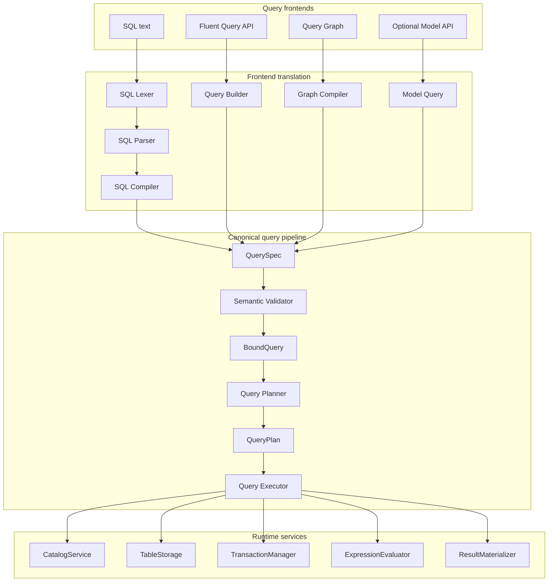

# GDSQL Canonical Query Architecture

## Purpose

The redesigned GDSQL architecture establishes a clear separation between:

- The interfaces used to describe database operations.
- The internal representation of those operations.
- Validation and planning.
- Query execution.
- Catalog metadata.
- Physical storage.
- Result presentation.
- Editor tooling.

The core architectural principle is that every query frontend produces the same canonical representation.


```mermaid
flowchart TD
    subgraph Frontends["Query frontends"]
        SQL["SQL text"]
        Fluent["Fluent Query API"]
        Graph["Query Graph"]
        Model["Optional Model API"]
    end

    subgraph Translation["Frontend translation"]
        Lexer["SQL Lexer"]
        Parser["SQL Parser"]
        Compiler["SQL Compiler"]
        Builder["Query Builder"]
        GraphCompiler["Graph Compiler"]
        ModelQuery["Model Query"]
    end

    subgraph Canonical["Canonical query pipeline"]
        Spec["QuerySpec"]
        Validator["Semantic Validator"]
        Bound["BoundQuery"]
        Planner["Query Planner"]
        Plan["QueryPlan"]
        Executor["Query Executor"]
    end

    subgraph Runtime["Runtime services"]
        Catalog["CatalogService"]
        Storage["TableStorage"]
        Transactions["TransactionManager"]
        Expressions["ExpressionEvaluator"]
        Materializer["ResultMaterializer"]
    end

    SQL --> Lexer --> Parser --> Compiler --> Spec
    Fluent --> Builder --> Spec
    Graph --> GraphCompiler --> Spec
    Model --> ModelQuery --> Spec

    Spec --> Validator --> Bound --> Planner --> Plan --> Executor

    Executor --> Catalog
    Executor --> Storage
    Executor --> Transactions
    Executor --> Expressions
    Executor --> Materializer
```

The intended dependency direction is:

```text
Frontend input
    ↓
Frontend-specific translator
    ↓
QuerySpec
    ↓
Semantic validation and binding
    ↓
QueryPlan
    ↓
QueryExecutor
    ↓
Catalog and storage contracts
    ↓
ConfigFile / .cfg implementation
```

---

## 1. `QuerySpec`

`QuerySpec` is a typed, frontend-independent description of a requested database operation.

It answers:

> What operation has been requested?

It represents query meaning without defining how the operation will be executed.

The following inputs should be capable of producing equivalent `QuerySpec` objects:

```text
SQL text
Fluent Query API
Query Graph
Optional model or repository API
```

For example:

```sql
SELECT name, health
FROM heroes
WHERE health > 100
ORDER BY health DESC
LIMIT 10;
```

may be represented as:

```gdscript
var query := SelectQuerySpec.new()

query.source = TableReference.new(&"heroes")
query.projections = [
    SelectProjection.new(
        ColumnExpression.new(&"name")
    ),
    SelectProjection.new(
        ColumnExpression.new(&"health")
    ),
]
query.predicate = ComparisonExpression.new(
    ColumnExpression.new(&"health"),
    ComparisonOperator.GREATER_THAN,
    LiteralExpression.new(100)
)
query.ordering = [
    OrderClause.new(
        ColumnExpression.new(&"health"),
        SortDirection.DESCENDING
    )
]
query.limit = 10
```

The representation describes the requested operation but does not access table files, iterate rows, or persist data.

---

## 2. `QuerySpec` containment

`QuerySpec` contains query meaning rather than runtime infrastructure.

Its contents may include:

- Query operation type.
- Source tables.
- Selected expressions.
- Predicates.
- Join definitions.
- Grouping expressions.
- Ordering clauses.
- Inserted values.
- Update assignments.
- Limits and offsets.

Runtime infrastructure remains outside the canonical model:

- Storage sessions.
- `ConfigFile` instances.
- File paths.
- Loaded rows.
- Transaction state.
- Editor controls.
- Workbench services.
- Query execution state.
- Cached query plans.
- Persistence callbacks.

The preferred flow is:

```gdscript
var query: QuerySpec = frontend.compile(input)
var validation := validator.validate(query)
var plan := planner.create_plan(validation.bound_query)
var execution := executor.execute(plan)
```

A `QuerySpec` is treated as descriptive data rather than an executable object.

---

## 3. Query model hierarchy

Godot 4.5 abstract classes and methods provide explicit contracts for the redesigned architecture.

Adopting `@abstract` makes Godot 4.5 the minimum supported version unless a compatibility layer is maintained.

```gdscript
@abstract
class_name QuerySpec
extends RefCounted

enum Operation {
    SELECT,
    INSERT,
    UPDATE,
    DELETE,
}

var operation: Operation

@abstract
func accept(visitor: QuerySpecVisitor) -> Variant
```

Concrete query types expose only the information relevant to their operation.

### Select

```gdscript
class_name SelectQuerySpec
extends QuerySpec

var source: QuerySource
var projections: Array[SelectProjection] = []
var joins: Array[JoinSpec] = []
var predicate: QueryExpression
var grouping: Array[QueryExpression] = []
var having: QueryExpression
var ordering: Array[OrderClause] = []
var limit: int = -1
var offset: int = 0
var distinct: bool = false

func _init() -> void:
    operation = Operation.SELECT

func accept(visitor: QuerySpecVisitor) -> Variant:
    return visitor.visit_select(self)
```

`SelectProjection` associates an output expression with an optional result
alias. The alias belongs to the selected output item rather than to the
expression itself, allowing expressions to remain reusable in predicates,
ordering, grouping, and updates.

### Insert

```gdscript
class_name InsertQuerySpec
extends QuerySpec

var target: TableReference
var columns: Array[StringName] = []
var rows: Array[InsertRow] = []

func _init() -> void:
    operation = Operation.INSERT

func accept(visitor: QuerySpecVisitor) -> Variant:
    return visitor.visit_insert(self)
```

### Update

```gdscript
class_name UpdateQuerySpec
extends QuerySpec

var target: TableReference
var assignments: Array[ColumnAssignment] = []
var predicate: QueryExpression

func _init() -> void:
    operation = Operation.UPDATE

func accept(visitor: QuerySpecVisitor) -> Variant:
    return visitor.visit_update(self)
```

### Delete

```gdscript
class_name DeleteQuerySpec
extends QuerySpec

var target: TableReference
var predicate: QueryExpression

func _init() -> void:
    operation = Operation.DELETE

func accept(visitor: QuerySpecVisitor) -> Variant:
    return visitor.visit_delete(self)
```

The visitor mechanism allows validators, planners, serializers, and diagnostic tools to handle each concrete query type through a common entry point.

It remains an implementation choice rather than a mandatory pattern. Direct typed methods may replace visitors when they provide a simpler design.

---

## 4. Canonical expression model

Filters, calculated values, join conditions, grouping expressions, and ordering expressions use a shared expression model.

The following expression:

```sql
health > 100 AND class = 'mage'
```

should have one canonical representation regardless of whether it originated from SQL, the fluent API, or a graph.

```gdscript
@abstract
class_name QueryExpression
extends RefCounted

@abstract
func accept(visitor: ExpressionVisitor) -> Variant
```

### Column reference

```gdscript
class_name ColumnExpression
extends QueryExpression

var table_alias: StringName
var column_name: StringName

func _init(
    p_column_name: StringName,
    p_table_alias: StringName = &""
) -> void:
    column_name = p_column_name
    table_alias = p_table_alias

func accept(visitor: ExpressionVisitor) -> Variant:
    return visitor.visit_column(self)
```

### Literal value

```gdscript
class_name LiteralExpression
extends QueryExpression

var value: Variant

func _init(p_value: Variant) -> void:
    value = p_value

func accept(visitor: ExpressionVisitor) -> Variant:
    return visitor.visit_literal(self)
```

### Comparison

```gdscript
class_name ComparisonExpression
extends QueryExpression

var left: QueryExpression
var operator: ComparisonOperator
var right: QueryExpression

func accept(visitor: ExpressionVisitor) -> Variant:
    return visitor.visit_comparison(self)
```

### Logical composition

```gdscript
class_name LogicalExpression
extends QueryExpression

var left: QueryExpression
var operator: LogicalOperator
var right: QueryExpression

func accept(visitor: ExpressionVisitor) -> Variant:
    return visitor.visit_logical(self)
```

### Scalar expression semantics

The canonical scalar model also includes:

- `ArithmeticExpression` for numeric arithmetic and string addition.
- `NullCheckExpression` for explicit `IS NULL` and `IS NOT NULL` checks.
- `FunctionExpression` for registered scalar or aggregate calls.

Scalar evaluation follows SQL-like null propagation. Arithmetic and ordinary
comparisons return `null` when an operand is `null`; predicates treat that
unknown result as non-matching. Logical expressions use three-valued `AND`,
`OR`, and `NOT` semantics. Explicit null checks always return a boolean.

The query-level function catalog exposes definitions containing name, arity,
return type, and aggregate classification. Validation depends on this metadata,
while the execution-level registry owns the matching scalar and aggregate
callables. The initial runtime provides `lower`, `upper`, `length`, `abs`,
`coalesce`, `resource_property`, `count`, `sum`, `avg`, `min`, and `max`.
`resource_property` accepts only a constrained Resource column and a literal
Inspector-visible scalar-leaf path validated against catalog metadata. Compound
values such as `Vector3` are not valid leaves; their supported scalar
components are. Bound functions retain a resolved return type when their type
depends on validated arguments. Function existence, arity, argument
compatibility, expression type compatibility, aggregate
placement, and grouped-expression compatibility are validated before planning.
Aggregate execution groups rows before HAVING, ordering, and projection.

Expression objects describe meaning. Evaluation is performed separately:

```gdscript
var matches := expression_evaluator.evaluate(
    expression,
    row_context
)
```

This separation allows expressions to be:

- Validated before execution.
- Displayed in the graph editor.
- Included in diagnostics.
- Serialized for debugging.
- Evaluated against different row representations.
- Translated into native operations later.

### 4.1 Typed expression convenience frontend

`GDSQLExpr` is the code-facing convenience frontend over the canonical
expression classes. It directly creates the existing typed expression nodes,
while fluent
combinators on `GDSQLQueryExpression` remove constructor and enum repetition:

```gdscript
GDSQLExpr.column(&"level").add(1)
GDSQLExpr.column(&"health").greater_than(100)
GDSQLExpr.column(&"name").equals("Mage")
GDSQLExpr.and_(condition_a, condition_b)
```

Operands may also be expressions, allowing calculations between columns:

```gdscript
GDSQLExpr.column(&"damage").add(GDSQLExpr.column(&"bonus"))
```

The factories are:

- `column(column_name, table_alias)` for an optionally qualified column.
- `resource_property(column_name, property_path, table_alias)` for a validated
  scalar leaf of a constrained Resource column.
- `literal(value)` for an explicit literal.
- `and_(left, right)`, `or_(left, right)`, and `not_(expression)` for logical
  composition.
- `scalar(name, arguments)` and `aggregate(name, arguments)` for function
  expressions.

Every canonical expression supports comparison combinators (`equals()`,
`not_equals()`, `greater_than()`, `less_than()`, and their inclusive forms),
arithmetic combinators (`add()`, `subtract()`, `multiply()`, `divide()`, and
`modulo()`), logical chaining, and `is_null()` / `is_not_null()` checks. Each
combinator creates a new expression node and leaves its receiver unchanged.

Literal coercion is explicit in the helper implementation: an operand that is
already a `GDSQLQueryExpression` is preserved, while any other `Variant`, such
as `1`, `null`, or `"Mage"`, becomes a `GDSQLLiteralExpression`. A string passed
to `equals()` or a function argument represents data. SQL expression strings
enter through the SQL compiler. The graph frontend can construct the same typed
nodes and later render them as copyable `GDSQLExpr` GDScript.

An expression-based update remains compact and follows the canonical query
pipeline:

```gdscript
database.table(&"heroes") \
    .update() \
    .set_expression(&"level", GDSQLExpr.column(&"level").add(1)) \
    .where(GDSQLExpr.column(&"id").equals(hero_id)) \
    .build()
```

---

## 5. SQL lexer

The lexer converts SQL source text into tokens.

```text
Input:
SELECT name FROM heroes WHERE health >= 100

Output:
KEYWORD_SELECT
IDENTIFIER("name")
KEYWORD_FROM
IDENTIFIER("heroes")
KEYWORD_WHERE
IDENTIFIER("health")
GREATER_THAN_OR_EQUAL
NUMBER_LITERAL(100)
END_OF_INPUT
```

```gdscript
@abstract
class_name SqlLexer
extends RefCounted

@abstract
func tokenize(source: String) -> TokenizationResult
```

```gdscript
class_name TokenizationResult
extends RefCounted

var tokens: Array[SqlToken] = []
var diagnostics: Array[QueryDiagnostic] = []

func is_successful() -> bool:
    return diagnostics.is_empty()
```

The lexer recognizes:

- Keywords.
- Identifiers.
- Literals.
- Operators.
- Separators.
- Comments.
- Quoted names.
- Source positions.

Its input is text and its output is token data. Catalog lookup, query execution, and editor presentation remain outside this layer.

---

## 6. SQL parser

The parser converts tokens into a SQL syntax tree.

```gdscript
@abstract
class_name SqlParser
extends RefCounted

@abstract
func parse(tokens: Array[SqlToken]) -> SqlParseResult
```

The parser owns SQL grammar, including:

- Statement structure.
- Clause placement.
- Join syntax.
- Operator precedence.
- Parenthesized expressions.
- Function calls.
- Aliases.
- Grouping.
- Ordering.
- Limits and offsets.

For example:

```sql
SELECT name
FROM heroes
WHERE health > 100;
```

may produce:

```text
SqlSelectStatement
├── projections
│   └── SqlColumnNode("name")
├── source
│   └── SqlTableNode("heroes")
└── where_clause
    └── SqlBinaryExpressionNode
        ├── SqlColumnNode("health")
        ├── GREATER_THAN
        └── SqlLiteralNode(100)
```

The syntax tree may preserve SQL-specific information:

- Token positions.
- Original aliases.
- Parentheses.
- Keyword forms.
- Source spans.
- Parse-recovery information.

```gdscript
class_name SqlParseResult
extends RefCounted

var statement: SqlStatement
var diagnostics: Array[QueryDiagnostic] = []

func is_successful() -> bool:
    return statement != null and diagnostics.is_empty()
```

Diagnostics are returned as data. The editor determines how they are displayed.

---

## 7. SQL compilation

The SQL AST and `QuerySpec` represent different domains.

```text
SQL AST
    Represents SQL syntax.

QuerySpec
    Represents canonical query meaning.
```

A compiler translates between them.

```gdscript
@abstract
class_name SqlQueryCompiler
extends RefCounted

@abstract
func compile(
    statement: SqlStatement
) -> QueryCompilationResult
```

```gdscript
func compile_select(
    statement: SqlSelectStatement
) -> QueryCompilationResult:
    var query := SelectQuerySpec.new()

    query.source = _compile_source(statement.source)
    query.projections = _compile_projections(
        statement.projections
    )
    query.joins = _compile_joins(statement.joins)
    query.predicate = _compile_expression(
        statement.where_clause
    )
    query.grouping = _compile_expressions(
        statement.group_by
    )
    query.having = _compile_expression(statement.having)
    query.ordering = _compile_ordering(
        statement.order_by
    )
    query.limit = statement.limit
    query.offset = statement.offset

    return QueryCompilationResult.success(query)
```

Each frontend ends at the canonical model:

```text
SQL frontend:
SQL text → tokens → SQL AST → QuerySpec

Graph frontend:
Graph model → QuerySpec

Fluent API:
Builder state → QuerySpec

Model API:
Model operation → QuerySpec
```

Input-specific concerns end at `QuerySpec`.

---

## 8. Semantic validation

The parser determines whether SQL follows the grammar.

The semantic validator determines whether the query is meaningful within the database catalog.

```sql
SELECT unknown_column
FROM heroes;
```

This statement may be syntactically valid while remaining semantically invalid.

```gdscript
@abstract
class_name QueryValidator
extends RefCounted

@abstract
func validate(
    query: QuerySpec,
    catalog: CatalogSnapshot
) -> QueryValidationResult
```

The catalog may instead be injected as a stable constructor dependency:

```gdscript
class_name DefaultQueryValidator
extends QueryValidator

var _catalog: CatalogService

func _init(catalog: CatalogService) -> void:
    _catalog = catalog

func validate(
    query: QuerySpec
) -> QueryValidationResult:
    return _validate_against(
        query,
        _catalog.create_snapshot()
    )
```

Validation includes:

- Database and table existence.
- Column resolution.
- Alias resolution.
- Expression type compatibility.
- Aggregate usage.
- Insert value compatibility.
- Required columns.
- Primary-key restrictions.
- Valid limits and offsets.
- Function existence and arguments.
- Join source validity.

Diagnostics use a typed representation:

```gdscript
class_name QueryDiagnostic
extends RefCounted

enum Severity {
    INFO,
    WARNING,
    ERROR,
}

var code: StringName
var severity: Severity
var message: String
var source_span: SourceSpan
var related_object: Variant
```

Each diagnostic belongs to the stage that produced it.

---

## 9. Binding

A raw query may contain unresolved names:

```gdscript
ColumnExpression.new(&"health")
```

Binding resolves those names against the catalog:

```text
BoundColumnExpression
├── table_id: TableId("game", "heroes")
├── column_id: ColumnId("health")
└── data_type: TYPE_INT
```

Multi-source binding resolves every table reference into a
`BoundTableSource`, preserving its alias and whether an outer join can make its
columns nullable. Join conditions are bound after the new source is added, so
they may reference the new table and any source introduced before it.

Unqualified columns are accepted only when exactly one visible source contains
that name. A duplicate column name across sources produces an ambiguous-column
diagnostic and requires qualification. Bound expressions use stable table IDs
plus a source qualifier, allowing separate occurrences of the same table in a
self-join to remain distinguishable during execution.

```gdscript
class_name BoundQuery
extends RefCounted

var source_query: QuerySpec
var root_operation: BoundQueryOperation
var referenced_tables: Array[TableDefinition] = []
var output_schema: ResultSchema
```

The distinction is:

```text
QuerySpec
    Canonical query meaning.
    May contain unresolved names.

BoundQuery
    Catalog-resolved and type-checked query.
    Ready for planning.
```

Binding may initially be implemented as part of validation, while retaining a separate conceptual boundary.

---

## 10. Query planning

The planner converts a validated query into executable operations.

```text
QuerySpec:
What data operation was requested?

QueryPlan:
Which runtime operations will perform it?
```

Example plan:

```text
Limit(10)
└── Distinct
    └── Project(name AS display_name, health)
        └── Sort(health DESC)
            └── Filter(health > 100)
                └── TableScan(heroes)
```

```gdscript
@abstract
class_name PlanNode
extends RefCounted

var output_schema: ResultSchema

@abstract
func accept(visitor: PlanNodeVisitor) -> Variant
```

```gdscript
class_name TableScanPlan
extends PlanNode

var table: TableDefinition
var alias: StringName
var pushed_offset: int = 0
var pushed_limit: int = -1

func accept(visitor: PlanNodeVisitor) -> Variant:
    return visitor.visit_table_scan(self)
```

```gdscript
class_name FilterPlan
extends PlanNode

var input: PlanNode
var predicate: QueryExpression

func accept(visitor: PlanNodeVisitor) -> Variant:
    return visitor.visit_filter(self)
```

```gdscript
class_name SortPlan
extends PlanNode

var input: PlanNode
var ordering: Array[OrderClause]

func accept(visitor: PlanNodeVisitor) -> Variant:
    return visitor.visit_sort(self)
```

```gdscript
class_name LimitPlan
extends PlanNode

var input: PlanNode
var limit: int
var offset: int

func accept(visitor: PlanNodeVisitor) -> Variant:
    return visitor.visit_limit(self)
```

The first planner may produce deterministic plans without cost estimation.
Ordering is applied to source rows before projection so a query may order by a
source column that is not returned. Projection establishes public output names
and the result schema. Distinct selection removes duplicate projected rows
before limit and offset are applied.

The planner may attach `OFFSET`/`LIMIT` directly to a table scan only for a
single-table query without a predicate, join, grouping, aggregate, ordering, or
distinct operation. These conditions guarantee that downstream operators cannot
change which source rows belong to the requested window. Other queries retain
an explicit `LimitPlan` after their relational operators.

When that same safe query has `ORDER BY`, the planner may instead emit an
`OrderedIndexScanPlan` when every order clause is a bound column, all directions
match, and the ordered columns match a catalog index prefix. The node carries
the index, direction, required columns, and result window. It replaces both
`SortPlan` and `LimitPlan`; queries with predicates or other row-set-changing
operators keep the complete relational pipeline.

```gdscript
func plan_select(
    query: BoundSelectQuery
) -> QueryPlan:
    var current: PlanNode = TableScanPlan.new(
        query.source
    )

    if query.predicate != null:
        current = FilterPlan.new(
            current,
            query.predicate
        )

    if not query.grouping.is_empty() or query.has_aggregates():
        current = AggregatePlan.new(
            current,
            query.grouping,
            query.aggregate_expressions
        )

    if query.having != null:
        current = FilterPlan.new(
            current,
            query.having
        )

    if not query.ordering.is_empty():
        current = SortPlan.new(
            current,
            query.ordering
        )

    current = ProjectionPlan.new(
        current,
        query.projections
    )

    if query.distinct:
        current = DistinctPlan.new(current)

    if query.limit >= 0 or query.offset > 0:
        current = LimitPlan.new(
            current,
            query.limit,
            query.offset
        )

    return QueryPlan.new(current)
```

Later implementations may choose among alternative operations:

```text
TableScanPlan
OrderedIndexScanPlan
PrimaryKeyLookupPlan
IndexLookupPlan
NestedLoopJoinPlan
HashJoinPlan
```

The selected plan may depend on:

- Available indexes.
- Table size.
- Query predicates.
- Storage capabilities.
- Cached metadata.
- Backend implementation.

These decisions do not alter `QuerySpec`.

### 10.1 Indexes and storage capabilities

Indexes are an execution and storage capability rather than a second query
model. `IndexDefinition` stores a stable name, an ordered column list, and a
uniqueness policy in catalog metadata. `StorageCapabilities` reports exact and
range lookup, bounded scan, and ordered-index read support without making the
planner depend on a concrete backend.

The deterministic planner chooses among table scan, ordered-index scan,
primary-key lookup, exact index lookup, and range lookup based on bound
predicates, index metadata, and reported storage capabilities. The initial
predicate optimization recognizes literal
comparisons against single-column indexes, including indexed comparisons inside
an `AND` predicate. It retains the complete predicate as a filter after the
lookup, preserving semantics when other conditions are present. Composite
indexes are represented and enforce uniqueness, while composite lookup-prefix
planning remains a later optimization.

Storage owns index maintenance and lookup execution. ConfigFile storage keeps
index entries in reserved table sections that associate indexed values with
primary-key sections. Entries are rebuilt as part of the same commit that
persists row mutations. A backend that reports no index support remains valid
and receives scan-based plans.

The initial join planner emits deterministic `NestedLoopJoinPlan` nodes in the
same order as the canonical join clauses. `INNER` and `LEFT` joins are
executable. `RIGHT` and `FULL` remain represented by `JoinSpec`, but validation
returns a structured unsupported diagnostic until the corresponding unmatched
row propagation is implemented.

Joined intermediate rows retain source-qualified values for bound expression
evaluation. Explicit projections determine public output names. When a joined
query omits projections, the binder expands all source columns using
`qualifier.column` names to avoid collisions.

---

## 11. Query execution

The executor follows a `QueryPlan`.

```gdscript
@abstract
class_name QueryExecutor
extends RefCounted

@abstract
func execute(
    plan: QueryPlan,
    context: ExecutionContext
) -> QueryExecutionResult
```

```gdscript
class_name ExecutionContext
extends RefCounted

var catalog: CatalogService
var storage: TableStorage
var transactions: TransactionManager
var expression_evaluator: ExpressionEvaluator
var function_registry: QueryFunctionRegistry
var cancellation: QueryCancellationToken
var session: StorageSession
```

The executor may:

- Read table snapshots.
- Iterate rows.
- Evaluate predicates.
- Perform joins.
- Group rows.
- Calculate aggregates.
- Sort intermediate results.
- Apply limits and offsets.
- Stage mutations.
- Commit or roll back transactions.
- Produce execution statistics.
- Return an internal row set.

The executor operates on plans and runtime services. SQL syntax, graph nodes, editor controls, and physical file paths remain outside its responsibilities.

The initial mutation slice supports single-table `INSERT`, `UPDATE`, and
`DELETE`. Update assignments and mutation predicates are validated and bound
before planning. Execution reads matching rows, stages changes through
`TableStorage`, and commits once per query. Mutation results report affected
row counts and include the inserted, updated, or deleted rows. Updating a
primary key is intentionally rejected by the initial implementation.
ConfigFile storage validates primary-key and column-level unique constraints
against the final staged table state before persistence. A violation rolls back
the entire query, including multi-row inserts and updates. Nullable unique
columns permit multiple null values. Insert validation applies declared static
defaults, including an explicitly declared null default.

Integer primary keys may declare `auto_increment`. The ConfigFile backend owns
the mutable sequence and row count in a reserved table-file metadata section:

```ini
[__gdsql_metadata__]
row_count=42
next_auto_increment=58
```

Generated keys are reserved in the storage session and persisted only when the
mutation commits. Deletion reduces `row_count` but does not reduce or reuse the
sequence. An explicit key at or above the current sequence advances the next
generated value. If table metadata is absent or damaged, the storage backend
may derive a replacement high-water mark from the existing rows.

`Database.truncate_table()` is a distinct administrative operation. It stages
removal of every row together with `row_count = 0` and
`next_auto_increment = 1`, then commits through the same transaction manager
and final-state foreign-key validation as query mutations. It is not compiled
into a `DELETE`, because ordinary deletion must preserve the sequence.
`TableSnapshot` carries generated-key state so in-memory hydration and durable
checkpoints reproduce the authoritative sequence rather than deriving it only
from the surviving rows.

### 11.1 Callback-scoped transactions

Explicit multi-statement transactions are planned as a callback API:

```gdscript
database.transaction(
    func(transaction: GDSQLTransaction) -> void:
        transaction.execute(first_query)
        transaction.execute(second_query)
)
```

All callback executions share one storage session. Leaving the callback commits
only when every execution succeeded; otherwise the runtime rolls back. The
transaction object cannot be reused after the callback and reads inside the
callback must observe earlier staged writes. This avoids abandoned transactions
and preserves ordinary `execute()` as an automatically committed operation.

`Database.transaction()` returns an `OperationResult`. A statement-level
validation, planning, execution, or staging error marks the scope as failed and
prevents later statements from executing. Constraints that require the complete
staged database state are validated during the final commit. A commit failure
also rolls back the shared session and is returned through structured
diagnostics.

#### Capturing statement results

Most callers only need the transaction-level result because the scope records
any failed statement automatically:

```gdscript
var result := database.transaction(
    func(transaction: GDSQLTransaction) -> void:
        transaction.execute(first_query)
        transaction.execute(second_query)
)
```

When individual query results are needed after the callback, they must be
stored in a shared mutable container. GDScript lambdas capture a local variable
slot by value. Reassigning that captured slot does not reassign the outer local
variable, even when its declared type is `GDSQLQueryResult`:

```gdscript
var first_result: GDSQLQueryResult

database.transaction(
    func(transaction: GDSQLTransaction) -> void:
        # Rebinds the lambda's captured slot; first_result remains null outside.
        first_result = transaction.execute(first_query)
)
```

A typed array is the recommended representation for an ordered collection of
statement results. Both scopes refer to the same Array object, and `append()`
mutates that object:

```gdscript
var statement_results: Array[GDSQLQueryResult] = []

var result := database.transaction(
    func(transaction: GDSQLTransaction) -> void:
        statement_results.append(transaction.execute(first_query))
        statement_results.append(transaction.execute(second_query))
)
```

A dictionary is useful when each result has a distinct meaning and named access
is clearer than positional access:

```gdscript
var statement_results := {
    "inventory": null,
    "quest": null,
}

var result := database.transaction(
    func(transaction: GDSQLTransaction) -> void:
        statement_results.inventory = transaction.execute(inventory_query)
        statement_results.quest = transaction.execute(quest_query)
)
```

The container choice is not relevant to database performance. An isolated
Godot 4.7 microbenchmark that created one callback and captured two values per
iteration found the typed array fastest, with dictionary capture approximately
1.36 times its cost and a newly allocated typed holder approximately 1.67 times
its cost. That difference was below one microsecond per callback on the measured
machine. When the same two strategies executed two real statements and one
ConfigFile commit, their elapsed times differed by less than one percent and
changed order between runs.

These measurements are illustrative rather than an API guarantee. Query
validation, planning, row work, and storage persistence dominate the operation.
Choose a typed array for ordered results and a dictionary or typed holder when
named access materially improves readability. Timing assertions do not belong
in the behavioral transaction test suite because they would be
platform-dependent and flaky.

### 11.2 Database registry

`GDSQLDatabaseRegistry` keeps open `GDSQLDatabase` handles under registration
names. Logical roles point to those registrations:

```gdscript
var registry := GDSQLDatabaseRegistry.new()
registry.register(&"base_content", content_database)
registry.register(&"slot_1", save_database)
registry.bind_role(GDSQLDatabaseRegistry.CONTENT_ROLE, &"base_content")
registry.bind_role(GDSQLDatabaseRegistry.SAVE_ROLE, &"slot_1")

var active_save := registry.resolve_role(
    GDSQLDatabaseRegistry.SAVE_ROLE,
).get_database()
```

Binding a role again selects another registered handle. This supports active
save selection, effective-content replacement, settings, analytics, and
project-defined roles through one API. Unregistering a handle also clears each
role that selected it. Every lifecycle and resolution operation returns a
`GDSQLDatabaseResult` with structured diagnostics.

Game code changes save slots through `GDSQLRuntimeSession.select_save_slot()`.
The session resolves the target first, checkpoints committed dirty state in the
previous slot, and changes the role only after both operations succeed. Models
materialized before a role change retain their source database identity and
reject `save()`, `refresh()`, or `delete()` against the newly selected slot;
game code must query a fresh instance after switching.

Durable registration metadata uses `GDSQLDatabaseRegistration` and
`GDSQLDatabaseRegistrySnapshot`. `GDSQLConfigFileDatabaseRegistryStore` stores
the snapshot in `user://gdsql/databases.cfg`, allowing runtime startup and
editor tools to inspect database roots, backend types, role selections, and
stable migration streams. A migration stream identifies the project-owned
schema history independently from a physical database or registration name.
It defaults to the logical database name, remains unchanged when a database is
renamed, and may be shared by multiple physical save slots. Open handles remain
attached to the active application context.

One `DatabaseRegistration` identifies one logical database. The snapshot and
registry form the collection that knows every registered database. Registration
metadata can therefore be loaded without opening every database or reading its
rows. `get_registrations()` and `get_registration()` inspect the loaded durable
metadata independently from `resolve()`, which still resolves an open handle.

`DatabaseExplorer` provides lightweight discovery for explicitly supplied
roots. Its ConfigFile implementation reads `databases.cfg`, schema summaries,
and reserved table metadata such as row count. It does not enumerate row
sections or materialize `RowRecord` objects. Save discovery is bounded to a
configured parent such as `user://gdsql/saves/`; arbitrary recursive scanning
of `user://` is outside this responsibility. ConfigFile inspection still parses
the physical file because `ConfigFile` has no header-only read API; only header
metadata is returned, while a paged backend can read its header independently.

The editor reserves the `project` registration name for `res://data`. A database
created below another explicit root uses that root's final directory name, such
as `save_1` or `settings`. If a newly discovered database still proposes a name
owned by a different logical database and root, the workbench preserves the
existing registration and assigns the newcomer a deterministic unique name.
That resolved name is persisted, so later loads inspect the user database
without recursively scanning `user://` or recreating the collision.

### 11.3 Persistence semantics and checkpoints

A transaction commit establishes valid, visible database state. A checkpoint
transfers committed dirty state to durable storage. ConfigFile storage performs
durable work during commit. In-memory storage commits authoritative rows to
memory and records a dirty version for every affected table.

`GDSQLCheckpointTarget` exposes `is_dirty()` and `checkpoint()`.
`GDSQLPersistenceCoordinator` associates targets with typed policies and
coordinates explicit, dirty-set, and immediate post-commit checkpoints:

```gdscript
var persistence := GDSQLPersistenceCoordinator.new()
persistence.register(
    &"save_1",
    buffered_save_storage,
    GDSQLCheckpointPolicy.periodic(30.0),
)

var result := persistence.checkpoint(&"save_1")
```

`GDSQLCheckpointResult` records databases that reached durable storage and
databases that remain dirty for a later retry. Periodic scheduling and graceful
shutdown integration belong to the optional runtime Node adapter.

`GDSQLRuntimeNode` implements that scene-tree boundary without moving storage
or model services into a Node. Its scene-owned Timer checkpoints committed
dirty registrations on one configurable interval. Application-pause and
tree-exit notifications may request a synchronous final checkpoint before the
node releases its `GDSQLRuntimeSession`. The node emits results for game UI but
does not print failures or decide whether a game may quit.

`GDSQLRuntimeFactory.bootstrap()` is the supported application composition
path. It loads the durable registry snapshot and opens each registration's
durable authoring source. Before runtime hydration or model registration,
`GDSQLMigrationStartupCoordinator` brings that source to its trusted schema
state. Bootstrap then opens the selected runtime backend, restores logical role
bindings, creates one `GDSQLModelContext`, and registers checkpoint targets for
in-memory databases. It returns a tested `GDSQLRuntimeSession` facade.
ConfigFile registrations need no checkpoint target because their commits are
already durable; explicit checkpoint calls for those roles succeed without
writing again. Any migration or registration failure stops bootstrap before a
partial model context is installed.

Before opening registrations, bootstrap evaluates the snapshot through
`GDSQLDirectSetupInspector` for direct or unselected setup profiles. Missing or
unsafe direct-profile bindings become structured warnings, so games can
diagnose the supported content plus active-save setup without preventing
intentional custom-role compositions. Managed bootstrap omits those transient
direct-role warnings because effective content is installed after package
activation. The editor augments the same typed report with catalog, row, model,
and runtime-autoload status; the inspector itself accesses neither files nor
Controls.

Project onboarding persists one explicit `GDSQLSetupProfile` through a
`GDSQLSetupProfileStore`. Direct and managed inspectors produce ordered typed
checks for their independent workflows. Changing this selection changes setup
guidance only; database and model migration is never implicit.

Managed package locations and enabled IDs are carried by one typed
`GDSQLManagedContentConfiguration`. Its store contract keeps the editor and
runtime on the same configuration, while the ConfigFile implementation owns
the `managed_content` section of `res://.gdsql/settings.cfg` and preserves other
settings. When the managed profile is selected, `GDSQLRuntimeNode` loads that
configuration after ordinary registry bootstrap and asks the runtime factory to
discover, resolve, cache, and activate the effective database. The node exposes
the session only after activation succeeds; a failure clears the partial model
context and is returned through the normal startup result and signals.

After automatic activation, `GDSQLRuntimeNode` loads the active save's expected
package manifest and compares it with the active cache. It retains the typed
compatibility report, emits it before `runtime_started`, and refreshes it after
a successful save-slot selection. An untracked, changed, missing, or unreadable
manifest does not turn successful runtime startup into failure; the game decides
whether that save may load.

`GDSQLInMemoryCheckpointTarget` composes an `InMemoryTableStorage` source with
an injected durable `TableStorage`. It synchronizes authoritative dirty tables
and clears a dirty marker only when the copied version remains current. This
adapter keeps checkpoint policy outside storage and keeps ConfigFile knowledge
outside the in-memory backend. `load_table()` establishes a clean authoritative
memory snapshot before runtime mutation when an existing durable dataset is
used as the source. Hydration and checkpoint reads preserve Resource locators;
neither operation loads an external asset merely to transfer or compare rows.

### 11.4 Content package metadata

Managed content begins with a typed `GDSQLContentPackageManifest`. It describes
base-game, DLC, or mod identity, semantic version, priority, required packages,
explicit before/after declarations, and package-relative data and asset paths.
`GDSQLContentPackageManifestValidator` validates only one manifest's local
invariants; discovery and cross-package graph validation remain separate.

Runtime content services depend on `GDSQLContentPackageManifestStore`.
`GDSQLConfigFileContentPackageManifestStore` is confined to
`storage/configfile`, translates `manifest.cfg` at the external-data boundary,
and returns the typed manifest with structured diagnostics. The manifest does
not load databases, enumerate packages, or apply overlays.

Editor setup may use `GDSQLConfigFileContentPackageScaffolder` to create the
base package envelope and fill only absent manifest fields. The enclosed data
root remains an ordinary GDSQL root whose catalog is created by the database
API; existing manifest values are never replaced implicitly.

`GDSQLContentPackageDiscovery` returns typed package sources from an explicit
base location and package containers. The ConfigFile implementation owns direct
directory enumeration and manifest decoding. `GDSQLContentPackageResolver`
then validates the enabled set, semantic-version constraints, dependencies, and
load-order graph. It returns a deterministic base-first topological order using
priority and package ID only as stable tie-breakers. Neither stage opens package
databases or mutates source content.

### 11.5 Content overlay application

`GDSQLContentPackageLayerReader` translates one package's selected logical
database into typed table definitions and `GDSQLContentRowOperation` values.
The ConfigFile implementation owns catalog, table-file, and `overlays.cfg`
decoding and preserves referenced-asset identity while copying rows.
`GDSQLContentOverlayLoader` depends only on this reader contract and validates
those inert references against the copied column definition.

The loader copies compatible schemas and rows into a deterministic
`GDSQLContentDatabaseSnapshot`. Later packages replace rows with the same
primary-key value, add new identities, and remove identities only through an
explicit removal operation. Source packages remain immutable. Cache writing,
cache invalidation, and registry role replacement remain separate stages.

Every successfully applied row operation emits a typed
`GDSQLContentRowProvenance` entry with table identity, row identity, package ID,
package version, and operation kind. Histories therefore retain explicit
removals while effective rows resolve their current winning package. When a
later upsert replaces an existing row, `GDSQLContentOverlayResult` records a
typed `GDSQLContentRowConflict` and an informational diagnostic; deterministic
last-layer-wins behavior remains successful rather than becoming an error.

### 11.6 Effective-content cache

`GDSQLContentCacheManager` computes an expected typed cache manifest through an
injected package fingerprint provider. Cache reuse requires the same manifest
format, source and effective database names, package order, package versions,
and package content hashes, plus a readable cached database. A missing, stale,
or malformed disposable cache triggers the same overlay build used without a
cache.

`GDSQLContentCacheStore` owns cache persistence. Its ConfigFile implementation
writes the complete snapshot and manifest to a bounded staging directory, then
replaces the previous cache directory. The manifest is written after the data,
so incomplete output cannot be mistaken for a compatible cache. Package source
directories remain authoritative and are never mutated or deleted.

### 11.7 Effective-content activation

`GDSQLRuntimeFactory.activate_effective_content()` composes cache preparation,
candidate database opening, and runtime role replacement. It does not mutate
the registry until the cache is compatible and the complete effective database
can be opened. A failure in fingerprinting, overlay construction, persistence,
or opening therefore leaves the current `content` role unchanged.

`GDSQLDatabaseRegistry.replace_role_database()` validates the candidate handle
and registration ownership before replacing the runtime-local registration and
role binding together. The disposable `effective_content` registration is not
written into editor-authored durable metadata. Replacing the handle invalidates
previously materialized content models through their retained source-database
identity; game code must query fresh models after content activation.

### 11.8 Save content compatibility

Managed saves may persist a `GDSQLSaveContentManifest` beside their database
catalog. It records the effective database name and ordered package
fingerprints that the save was created or explicitly confirmed against. The
ConfigFile adapter stores this external metadata in the save root; it does not
place package state inside gameplay tables.

`GDSQLSaveContentCompatibilityInspector` compares that expectation with the
active cache manifest. Its typed report separates untracked saves, missing
packages, changed versions or bytes, changed load order, and additional active
packages. These are diagnostics, not automatic mutations: the game must choose
whether to refuse loading, request packages, use fallbacks, or continue with
unresolved stable identifiers.

---

## 12. Storage boundary

The query runtime depends on an abstract storage contract.

```gdscript
@abstract
class_name TableStorage
extends RefCounted

@abstract
func read_table(
    table: TableDefinition,
    session: StorageSession,
    request: StorageReadRequest = null
) -> TableSnapshot

@abstract
func read_batch(
    table: TableDefinition,
    session: StorageSession,
    request: StorageReadRequest
) -> StorageReadBatch

@abstract
func read_index_batch(
    table: TableDefinition,
    index: IndexDefinition,
    direction: StorageOrderDirection,
    session: StorageSession,
    request: StorageReadRequest
) -> StorageReadBatch

@abstract
func find_by_primary_key(
    table: TableDefinition,
    key: Variant,
    session: StorageSession,
    request: StorageReadRequest = null
) -> RowRecord

@abstract
func stage_insert(
    table: TableDefinition,
    row: RowRecord,
    session: StorageSession
) -> StorageOperationResult

@abstract
func stage_update(
    table: TableDefinition,
    key: Variant,
    row: RowRecord,
    session: StorageSession
) -> StorageOperationResult

@abstract
func stage_delete(
    table: TableDefinition,
    key: Variant,
    session: StorageSession
) -> StorageOperationResult

@abstract
func commit(
    session: StorageSession
) -> StorageCommitResult

@abstract
func rollback(session: StorageSession) -> void
```

The ConfigFile implementation owns knowledge of:

- `.cfg` files.
- Table file paths.
- Section names.
- Primary-key-to-section mapping.
- `ConfigFile`.
- Godot `Variant` serialization.
- Resource serialization.
- Dirty state.
- Persistence.

```gdscript
class_name ConfigFileTableStorage
extends TableStorage

var _path_resolver: DatabasePathResolver
var _config_cache: ConfigFileCache
var _codec: GodotVariantCodec

func _init(
    path_resolver: DatabasePathResolver,
    config_cache: ConfigFileCache,
    codec: GodotVariantCodec
) -> void:
    _path_resolver = path_resolver
    _config_cache = config_cache
    _codec = codec
```

The containment boundary is:

```text
QueryExecutor
    depends on TableStorage.

ConfigFileTableStorage
    depends on ConfigFile, .cfg paths, codecs, and persistence.
```

Storage representations do not propagate upward into the canonical query model.

`GDSQLStorageReadRequest` is descriptive storage input, not query syntax. It
identifies the columns required by one planned table access and whether
referenced Resource values must remain inert. The planner derives required
columns from projection, predicates, joins, grouping, ordering, aggregates,
and row identity. ConfigFile storage can then skip unrelated keys and return
`GDSQLResourceReference` values without invoking `ResourceLoader`. The executor
materializes only required references through its injected resolver before
expression evaluation, preserving concrete Resource values in ordinary public
results. Resolver failures become query diagnostics containing database,
table, row, and column context.

Stage C extends the same request with an optional positive batch size and an
opaque `GDSQLStorageReadCursor`. A cursor is bound to its backend and source
table, and its token is created and interpreted only by that storage backend;
execution may retain it and pass it back, but cannot inspect its token or
translate it into query meaning. It remains valid only for the unchanged read
view that produced it. `read_batch()` returns a
`GDSQLStorageReadBatch` containing at most the requested rows, a continuation
when more rows remain, structured diagnostics, and typed
`GDSQLStorageReadStatistics`.

`read_index_batch()` applies the same bounded request to one catalog index in
ascending or descending value order. Its cursor token also identifies the
index and direction, so a continuation cannot be reused for a different
ordered read. The storage-specific direction type prevents the storage
contract from depending on query-model ordering enums. The initial ConfigFile
and in-memory adapters support composite index value order and staged-session
visibility while decoding or projecting only rows in the returned window.

Bounded result size and bounded physical I/O are intentionally distinct. The
statistics report rows scanned and returned, optional byte/page counts, and
whether the backend actually bounded physical reading. ConfigFile currently
parses its complete table file before decoding the requested row window, and
orders persisted index metadata before decoding the requested indexed window.
In-memory storage assembles and orders its effective row set before slicing it.
Both therefore report `physical_read_bounded == false` and the full inspected
row count. ConfigFile reports the table file length as `bytes_read` when a
batch causes a cache miss and disk parse, and `0` whenever the lookup is a
cache hit, including normal continuations; OS page counts remain unknown at
`-1`. In-memory storage retains
unknown byte/page counts because it cannot report a backend-neutral physical
measurement. This compatibility behavior establishes stable execution
semantics without pretending to provide the future binary backend's I/O
characteristics.

Table-scan and ordered-index execution consume these responses in bounded
batches of 256 rows. They keep one storage session and pass each opaque
continuation back to the same table backend until no continuation remains.
Storage diagnostics are merged into the query result, cancellation is checked
between batches, and a repeated continuation is rejected instead of permitting
a cursor cycle. Backends that do not advertise bounded table reads retain the
complete-snapshot compatibility path.

When a table or ordered-index scan carries a semantically safe pushed window,
execution skips its offset and stops at its limit before Resource
materialization and projection.
This prevents discarded rows from resolving referenced assets and avoids
unnecessary downstream work. It does not claim bounded disk I/O: compatibility
backends still report the complete row set they inspected, while future paged
backends may satisfy the same request through physical row or index pages.

`GDSQLQueryExecutionResult.statistics` aggregates `storage_batches`,
`storage_rows_scanned`, `storage_rows_returned`, `storage_bytes_read`,
`storage_pages_read`, and `storage_physical_read_bounded` independently from
Resource materialization counters. Unknown byte or page counts remain `-1`.
Queries with filters, joins, aggregates, sorting, distinct selection, or other
row-set-changing operations still assemble all batches before those operators
run. This preserves their semantics without assuming that an early storage
window is the final result window.

Internal row transfers use a full-column read request with reference
preservation. Managed package composition, effective-cache writes, in-memory
hydration, checkpoint comparison, constraint validation, and index rebuilding
therefore copy validated locator identity without materializing an asset. A
`GDSQLResourceReference` is accepted as an internal stored value only when its
ownership mode, expected Resource class, and project-script path match the
column. It is not exposed as an ordinary eager query result.

`GDSQLResourceHandle` is the explicit deferred-materialization state for one
reference. It copies the locator, owns an injected `GDSQLResourceResolver`, and
remains unloaded until `load()` is called. A successful load is type-checked
against the locator and cached by the handle; a failure retains structured
diagnostics and can be retried. `release()` removes only the handle's strong
reference because Godot's cache, scenes, or other consumers may still retain
the Resource. Threaded loading uses `request_load()` followed by non-blocking
`poll_load()` calls, with typed `GDSQLResourceLoadProgress` snapshots and
completion/failure signals. The Godot resolver adapts
`ResourceLoader.load_threaded_request()` and its status API; other resolvers may
return a structured unsupported diagnostic. This Stage B contract does not
silently replace concrete Resource values in ordinary query or model results.

`GDSQLQueryExecutionOptions.deferred_resources()` is the explicit opt-in at the
execution boundary. It is runtime presentation policy rather than query
meaning, so it never enters `QuerySpec`. A deferred SELECT returns an unloaded
`GDSQLResourceHandle` for each referenced Resource value and does not invoke
the resolver during the query. The planner records whether expression
evaluation requires concrete Resource values. Queries that filter, sort,
group, aggregate, join, or derive expressions from Resource columns reject
deferred execution with a structured diagnostic because those operations
require a concrete Resource. Callers use eager execution for that query instead
of receiving silently different semantics.

`GDSQLModelQuery.defer_resources()` applies the same policy to model results.
The concrete typed Resource property remains null until its retained handle
loads successfully; the model then updates the property without marking it as
a user mutation. Handles are available through `get_resource_handle()`, and
model-owned concrete/handle references can be released together through
`release_resource()` or `release_all_resources()`.

`GDSQLResourcePrefetchScope` is the bounded lifetime coordinator over a fixed
set of handles. Deferred query results and models create a scope through
`create_resource_prefetch_scope()`. The scope requests every unloaded handle,
polls them without blocking, emits aggregate progress/completion/failure, and
retains diagnostics while allowing unaffected requests to finish. Its typed
`GDSQLResourcePrefetchProgress` reports total, loaded, and failed counts.
`release()` releases every handle-owned strong reference and resets the scope
for another lifecycle; model properties connected to those handles are cleared
at the same time. It cannot cancel a native Godot threaded request or release
references owned by scenes, caches, or other consumers.

A future `GDSQLPagedBinaryTableStorage` can implement the same contract with
one binary file per table. Each file begins with a typed header containing the
format version, schema fingerprint, page size, row count, generated-key state,
and root page references for rows and indexes. Independently addressable pages
allow targeted row and index loading while preserving the current table-level
file organization.

---

## 13. Catalog boundary

The catalog represents database structure rather than database rows.

```gdscript
@abstract
class_name CatalogService
extends RefCounted

@abstract
func get_database(
    database_name: StringName
) -> DatabaseDefinition

@abstract
func get_table(
    database_name: StringName,
    table_name: StringName
) -> TableDefinition

@abstract
func has_table(
    database_name: StringName,
    table_name: StringName
) -> bool

@abstract
func create_snapshot() -> CatalogSnapshot
```

The catalog owns:

- Database definitions.
- Table definitions.
- Column definitions.
- Primary keys.
- Index definitions.
- Same-database foreign-key definitions.
- Default values.
- Nullability.
- Uniqueness.
- Auto-increment behavior.
- Configured data locations.

Catalog definitions are typed domain objects:

```gdscript
class_name DatabaseDefinition
extends RefCounted

var name: StringName
var tables: Array[TableDefinition] = []
```

```gdscript
class_name TableDefinition
extends RefCounted

var name: StringName
var columns: Array[ColumnDefinition] = []
var primary_key: StringName
var indexes: Array[IndexDefinition] = []
var foreign_keys: Array[ForeignKeyDefinition] = []
```

`ForeignKeyDefinition` describes one named local column referencing one unique
column in another table in the same logical database. Catalog foreign keys are
database-integrity metadata; model relationships remain navigation metadata.
References between runtime roles such as `save` and `content` are therefore not
catalog foreign keys because their physical databases can change independently
and cannot share one transaction.

The initial foreign-key contract supports exact `int`, `String`, and
`StringName` keys with `RESTRICT` update and deletion policies. Catalog
administration resolves the same-database target, requires an exact type match
and a primary, unique column, or single-column unique index, and rejects an
alteration when existing local values are orphaned. Transaction commit validates
the final effective rows of every constrained table in each touched database.
This makes inserts, updates, and `RESTRICT` deletes atomic while allowing a
transaction to stage related changes in either statement order. Catalog
administration rejects table or target-column lifecycle changes that would
invalidate an incoming reference, including removal of the target's last unique
contract. Self-referencing table and target-column renames update their own
constraint metadata. Schema authoring can therefore expose these operations
without permitting a silently broken catalog.

The table designer authors the same `ForeignKeyDefinition` and
`TableAlteration` types used by the catalog. Its local-column choices include
only supported key types; referenced table and column choices are narrowed to
exact-type, unique targets in other tables in the same database. The authoring
UI deliberately excludes the source table even though the catalog can preserve
pre-existing self-references. These controls are guidance, not a second
validation authority: catalog administration still validates the completed
definition before persistence. New constraints receive the deterministic name
`fk_<source_table>_<local_column>_<target_table>_<target_column>`, which updates
with the selected inputs instead of becoming stale editor state.

For row editing, a column with exactly one foreign-key definition exposes an
optional referenced-row picker. The result grid emits a lookup intent; the
editor coordinator executes a canonical, ordered `SELECT` against the target
table and returns typed rows to the grid. The grid never reads storage or the
catalog directly. The initial popup is deliberately bounded to 500 rows,
supports Godot's built-in type search, displays the referenced value with up to
two contextual fields, and applies the chosen key through the existing pending
cell-update path. Direct typed editing remains available when a target is
outside that bound or a local column has multiple constraints.

```gdscript
class_name ColumnDefinition
extends RefCounted

enum Generation {
	NONE,
	CREATED_AT,
	UPDATED_AT,
	# This policy boundary is going to allow UUID generation and more
	# storage-independent generated values.
}

var name: StringName
var data_type: Variant.Type
var nullable: bool
var unique: bool
var auto_increment: bool
var default: ColumnDefault
var generation: Generation
var resource_type: ResourceTypeConstraint
var resource_ownership: ResourceOwnership.Mode
```

`ColumnDefault` distinguishes no default (`default == null`) from an explicitly
declared null default (`default.value == null`) without adding a second boolean
that can disagree with the value. Static defaults remain schema metadata.
The component also gives defaults an independent extension point for future
default metadata or policies without adding parallel state to
`ColumnDefinition`; generated values remain a separate concern.
Generated-value policies describe runtime behavior without embedding generators
inside the catalog model. `created_at()` and `updated_at()` provide the initial
timestamp policies, while `TableDefinition.add_timestamps()` adds both common
columns. Both values use one Unix-millisecond timestamp per mutation statement:
`created_at` is generated on insert, and `updated_at` is generated on insert and
update. Callers cannot assign generated timestamp columns directly. Adding one
to a populated table backfills existing rows with one alteration timestamp.
Mutable row counts and generated-key sequences remain owned by physical storage.

Rows and query execution remain outside the catalog.

Database schema compatibility is tracked by the ordered migration history and
applied ledger described in section 13.2. Models remain bindings and never act
as schema or migration authorities.

### 13.1 Catalog administration

Catalog reads and catalog mutations use separate contracts. Query validation,
binding, planning, and execution depend only on `CatalogService`; they cannot
create or alter structure. Code-facing structure management enters through
`Database` and is delegated by `DatabaseContext` to
`CatalogAdministrationService`.

```gdscript
@abstract
class_name CatalogAdministrationService
extends RefCounted

@abstract
func create_database(database_name: StringName) -> CatalogOperationResult

@abstract
func rename_database(current_name: StringName, new_name: StringName) -> CatalogOperationResult

@abstract
func unregister_database(database_name: StringName) -> CatalogOperationResult

@abstract
func drop_database(database_name: StringName) -> CatalogOperationResult

@abstract
func create_table(
    database_name: StringName,
    table: TableDefinition,
) -> CatalogOperationResult

@abstract
func preview_create_table(
    database_name: StringName,
    table: TableDefinition,
) -> OperationResult

@abstract
func rename_table(database_name: StringName, current_name: StringName, new_name: StringName) -> CatalogOperationResult

@abstract
func preview_rename_table(
    database_name: StringName,
    current_name: StringName,
    new_name: StringName,
) -> OperationResult

@abstract
func alter_table(
    database_name: StringName,
    table_name: StringName,
    alterations: Array[TableAlteration],
) -> CatalogOperationResult

@abstract
func preview_alter_table(
    database_name: StringName,
    table_name: StringName,
    alterations: Array[TableAlteration],
) -> OperationResult

@abstract
func apply_change_plan(
    plan: CatalogChangePlan,
) -> CatalogOperationResult

@abstract
func drop_table(database_name: StringName, table_name: StringName) -> CatalogOperationResult

@abstract
func preview_drop_table(
    database_name: StringName,
    table_name: StringName,
) -> OperationResult
```

Unregistering removes a logical database from the catalog while preserving its
physical directory, schemas, table files, and rows. Creating the same logical
database under that data root registers and loads those existing files.
Dropping remains the explicitly destructive operation that also removes the
physical database directory.

The public API accepts typed `TableDefinition` and `ColumnDefinition` objects.
It does not accept ConfigFile sections or construct project paths. The concrete
ConfigFile administration service lives in `storage/configfile`, receives a
`DatabasePathResolver` through its constructor, and owns creation of database
registrations, workspace directories, and schema files.

Catalog mutations return `CatalogOperationResult` with structured diagnostics
for invalid definitions, duplicate objects, unreadable catalogs, and failed
persistence. Ordinary catalog failures are not printed or thrown.

Database creation establishes the project-owned structure described in section
17.1. Table creation persists both schema metadata and an empty backend table
file, so a successful operation leaves a complete, immediately usable table.
Row contents and later mutations remain owned by `TableStorage`. The ConfigFile
backend may complete a missing empty table file when an existing stored schema
exactly matches the requested definition; this repairs incomplete structures
without overwriting a table or changing its schema.

Table alterations are explicit typed intents for column lifecycle, display
order, defaults, nullability, uniqueness, generated-value and auto-increment
policies, and indexes. Reordering changes schema order only and does not rewrite
stored row values. The backend updates schema and existing row files together
for alterations that affect both. Adding a
non-nullable column to a populated table requires a compatible default;
renaming a column migrates stored row keys; dropping a column removes stored
values. Constraint changes validate existing rows before persistence, and
index changes rebuild backend index metadata.

Direct column data-type replacement is intentionally absent. The safe workflow
adds a column with the new type, moves or converts values through canonical
mutations, validates the result, and then drops the old column.

The create, alter, rename, and drop preview methods validate a complete request
without mutation and return a `CatalogChangePlan` with affected-row count,
concise summaries, destructive classification, and the required stale-state
evidence. Applying the plan compares that evidence with the current catalog and
rejects stale previews.
`alter_table()` remains the immediate code API by previewing and applying in
one call. Dropping the primary key is rejected. Database and table renames move
their complete physical structures and update catalog metadata, while drop
operations remove both metadata and owned storage.

### 13.2 Versioned migrations

Migration history is project-authored, forward-only input above catalog
administration. `GDSQLMigrationDefinition` owns one stable sortable ID, a
description, an ordered list of `GDSQLMigrationStep` values, and a deterministic
SHA-256 checksum. `GDSQLSchemaMigrationStep` targets one table and either reuses
the existing `GDSQLTableAlteration` vocabulary, carries one complete table
definition for creation, renames one table, or drops one table.
`GDSQLDataMigrationStep` describes one canonical UPDATE against one table with
typed assignments and an optional predicate. A definition recalculates its
checksum during validation, so changing an already recorded description,
operation, table, expression, column, index, default, or foreign key is rejected
as edited history.

Data-migration expressions reuse the canonical query model. Column, literal,
arithmetic, comparison, logical, null-check, and non-aggregate scalar-function
expressions are persisted deterministically. Table-qualified columns,
aggregate functions, Objects, Callables, Signals, and RIDs are rejected at the
authored boundary. Query validation remains authoritative for table, column,
function, assignment-type, and predicate-type compatibility.

IDs use only letters, digits, `_`, `-`, and `.`, and must be strictly increasing
under ordinal comparison. Timestamp-prefixed, fixed-width IDs are the
recommended authoring convention. Array order is authoritative; migrations
are never reordered automatically.

`GDSQLMigrationHistoryStore` is the project-source persistence contract for
loading and append-only extension of one migration stream. It is separate from
the per-database applied ledger: one authored stream may drive many physical
save databases, while each database records its own progress. Appends carry an
expected definition count so concurrent or stale editor sessions cannot
silently overwrite project history.

`GDSQLConfigFileMigrationHistoryStore` writes one immutable definition per file
under `res://.gdsql/migrations/<stream>/<migration_id>.cfg`. Files are sorted by
their stable IDs and activated from staging without replacing an existing
entry. `GDSQLMigrationDefinitionSerializer` is the dynamic serialization
boundary for typed alter, create, rename, drop, and row-update steps; canonical
data expressions; complete create-table definitions; and every current
`GDSQLTableAlteration` shape. Existing alteration-only definitions retain their
checksum representation. Loading recomputes and compares the authored checksum;
edited, renamed, malformed, duplicate, or out-of-order entries return
structured diagnostics.

`GDSQLMigrationSchemaState` is project-owned trust evidence for one migration
stream and logical database. It records an authored-history count and head, the
checksum of that exact prefix, and the whole-schema fingerprint produced at
that position. `GDSQLMigrationSchemaStateStore` persists this evidence
independently from both authored definitions and per-database applied ledgers.
The ConfigFile implementation uses
`res://.gdsql/migration_states/<stream>.cfg`, stale-checks updates, prevents an
established history position from being replaced, and activates staged writes
with recovery of the previous file. The empty-history origin may change while
the initial schema is still being designed; after a migration head exists,
advancement requires a later history position.

`GDSQLMigrationLedger` is the persistence contract for append-only applied
history. `GDSQLAppliedMigration` records the exact migration ID and checksum,
application time, and resulting whole-schema fingerprint. Both checksums are
validated SHA-256 values. `GDSQLSchemaFingerprint` deterministically hashes the
database name and sorted tables, indexes, and foreign keys while preserving
semantic column and key order.
`GDSQLConfigFileMigrationLedger` stores the ordered ledger at
`<data_root>/<database>/migrations.cfg`; the path remains owned by
`GDSQLDatabasePathResolver`.

An existing current-schema database can establish one explicit
`GDSQLMigrationBaseline` before ordinary applied records exist. The baseline is
not a synthetic applied migration. It records the adopted history head and its
checksum, a checksum of the complete adopted history prefix, adoption time,
and the verified whole-schema fingerprint. Adoption requires the caller's
typed project-owned schema state to match both the authored history prefix and
current catalog fingerprint. Adoption is rejected after any baseline or
applied record exists. This makes an empty
ledger unambiguous without claiming that historical migrations were executed.
Calculating a fingerprint from the candidate database and immediately passing
it back does not constitute independent verification.

Ledger mutations carry an expected ledger revision. A baseline contributes one
revision and each applied record contributes one, so stale planners cannot
silently append to or re-baseline changed evidence. The ConfigFile backend
uses one initial-1.0 ledger format containing the optional baseline and ordered
applied records. There is no pre-release format compatibility branch.

`GDSQLMigrationPlanner` compares authored definitions with the applied ledger.
Without a baseline, applied records must be an exact prefix. With a baseline,
the adopted prefix checksum must still match and ordinary records must be the
exact suffix immediately after that prefix. Absent authored history, reordered
IDs, checksum changes, malformed evidence, and divergent IDs return structured
diagnostics. A successful `GDSQLMigrationPlan` contains only the pending suffix,
reports whether it contains destructive alterations, and carries the current
ledger revision.

`GDSQLMigrationStepPlanner` receives catalog administration, the canonical
query pipeline, and an isolated simulator through constructor injection and
previews only the next pending history entry. A single step uses the direct
catalog or query preview. Multiple steps are evaluated in authored order by
`GDSQLMigrationSimulator` against isolated database state.

The ConfigFile simulator copies one database into temporary `user://` storage,
reuses the real catalog and query pipeline there, and removes the copy after
preview. Each schema plan or data count therefore observes every preceding
simulated step. This supports dependent schema operations, repeated-table data
updates, and mixed schema/data migrations without mutating source schema, rows,
or ledger. `GDSQLMigrationStepPreview` pairs each authored step with its catalog
plan or affected-row count; `GDSQLMigrationStepPlan` preserves their order,
summaries, destructive status, and expected ledger revision.

`GDSQLMigrationRecoveryStore` is the backend-neutral durable recovery contract.
It lists, creates, reloads, restores, and discards pre-migration database
snapshots. Listing lets startup discover recovery work without assuming a
backend path layout.
`GDSQLMigrationBackup` identifies that snapshot and carries its SHA-256 content
fingerprint and creation time. A backup is not a query transaction or a
long-term version archive; it is recovery evidence retained until its migration
finishes safely.

`GDSQLConfigFileMigrationRecoveryStore` copies the complete database directory,
including schemas, table rows and metadata, indexes, generated-key state, and
the applied ledger. Completed snapshots are activated from a staging directory
under `<data_root>/.gdsql_migration_recovery/<database>/<migration_id>` and are
verified before every restore. Restore copies into separate staging, moves the
current database aside, activates the verified snapshot with a directory swap,
and rolls the old directory back if activation fails. Cached ConfigFile table
entries are invalidated after successful recovery. Corrupt snapshots never
touch the active database, and identity-based discard permits explicit cleanup
even when a manifest or snapshot cannot be loaded.

`GDSQLMigrationRunner` composes the catalog, catalog administration, ledger,
and recovery contracts through constructor injection. `apply()` accepts only a
validated `GDSQLMigrationStepPlan`, reloads the ledger to reject stale history,
and compares the current whole-schema fingerprint with the last applied record
before creating a backup. The plan's database, table, authored checksum, and
typed operation must describe the same migration.

After those preconditions pass, the runner creates one durable backup, validates
each preview against its authored step, applies every schema and data operation
in authored order, fingerprints the resulting schema, and appends one
`GDSQLAppliedMigration` with the plan's expected ledger revision. A catalog,
query, changed data-step row count, fingerprint, or ledger failure restores the complete backup, including
all schema and rows changed earlier in the batch. The backup is discarded only after
successful ledger persistence or successful recovery. Cleanup failure retains
the backup and reports a warning without misreporting an otherwise committed
migration as failed.

`GDSQLMigrationRunResult` exposes the applied record, backup identity,
automatic-recovery status, and whether recovery files remain. The runner does
not infer migrations, apply multiple pending entries at once, or bypass catalog
validation.

`GDSQLMigrationService` is the supported orchestration boundary above those
components. `preview()` loads the durable ledger, checks the current schema
against the last baseline or applied fingerprint, validates the complete
authored history, and returns `GDSQLMigrationPreviewResult`. An up-to-date
history is a successful preview with no next step plan. `adopt_baseline()`
verifies and persists initial evidence for a pre-existing current-schema
database. `adopt_baseline_if_current()` performs the same adoption only when
the ledger is empty and the current schema independently matches the supplied
trusted state. `apply()` delegates one explicitly previewed plan to the runner.
These operations are exposed by the database facade so callers do not compose
backend migration services themselves.

`recover_interrupted()` resolves a named durable backup against the current
ledger. If the migration is absent and no later migration is recorded, it
restores the verified snapshot. If the ledger already contains the migration,
the schema and ledger commit completed and only backup cleanup was interrupted,
so the backup is discarded without restoring it. A missing migration followed
by a later applied ID is divergent history and is never recovered
automatically. `GDSQLMigrationRecoveryResult` reports which action occurred and
whether cleanup remains pending.

`recover_pending()` discovers every durable backup through the recovery-store
contract, rejects backup IDs absent from the authored history, and resolves
each authored interruption sequentially through `recover_interrupted()`.

`GDSQLMigrationStartupCoordinator` owns schema readiness during runtime
bootstrap. It loads the registration's authored stream and project-owned
schema state, verifies that the state names an exact authored-history prefix,
and targets only that verified prefix. A stream with history but no trusted
schema state fails closed. A stream with neither is an explicit unconfigured
no-op.

Project-owned `res://` registrations are read-only during runtime startup. The
coordinator accepts them without a physical ledger when their current schema
fingerprint equals the trusted project state. A mismatch fails with
`GDSQL_MIGRATION_PROJECT_SCHEMA_OUTDATED`; migrations must be applied in the
editor before running or exporting. Runtime startup never recovers, baselines,
or mutates project content.

Writable non-`res://` registrations recover pending backups before planning.
When an empty ledger already matches the trusted target, the coordinator may
adopt the verified history prefix as its initial baseline. It never derives
trust from the candidate database itself. Remaining entries are previewed and
applied one at a time through the recovery-safe service. The coordinator then
requires the durable catalog fingerprint to equal the trusted target before
bootstrap may hydrate an in-memory runtime or register models.
`GDSQLMigrationStartupResult` reports configuration, target history count,
baseline adoption, recovered IDs, and applied IDs without printing or owning
runtime UI.

`GDSQLRuntimeFactory.create_default()` composes this service for durable
ConfigFile databases and injects the same path resolver and ConfigFile cache
used by catalog and table storage. This shared cache is required so a restored
directory cannot leave stale rows visible in the active context. In-memory
runtime contexts do not expose migrations: schema history belongs to their
durable ConfigFile authoring source, which must migrate before hydration.
Editor history authoring and destructive confirmation remain a separate
product flow over this public API. The database document authors one table
step at a time: one existing-table alteration group, one new table definition,
one table rename, one table drop, or one typed row update. Data authoring reuses
the typed mutation-value and nested WHERE controls, excludes Resource literals,
requires an explicit choice before targeting every row, and is unavailable
while local schema drafts exist. It emits the common typed migration-step
intent to the editor controller, which rejects authoring while an earlier entry is pending,
previews the candidate complete history, and returns an
`EditorMigrationPreview` to the scene. The scene shows affected rows and
step summaries and always requires confirmation; destructive plans receive
an explicit warning. Confirmation appends the immutable project definition
before applying its already-previewed plan. If application fails, the appended
definition remains pending and is presented again on the next database open or
refresh. After a stream contains its first definition, the database document
disables direct structural saves; bypassing the ledger would invalidate its
recorded schema fingerprint. The v1 editor therefore keeps database rename and
multi-table drafts reversible but unapplied once history has started. Whenever
editor preview confirms that the durable database is at the authored history
head, the editor advances its project schema state. State persistence failure
is reported as a warning and does not recast an already committed catalog
migration as failed.

#### 13.1 Database lifecycle policy

Migration streams transform schema and rows inside one existing logical
database. Creating, renaming, unregistering, and destroying that database
container are administrative lifecycle operations, not migration steps.

A newly provisioned writable database has two valid entry paths. It may replay
a complete history whose declared origin is an empty database, or it may be
scaffolded directly at the trusted current schema and receive a verified
baseline. Runtime replay and verified baseline adoption are implemented.
`GDSQLEditorFreshSaveProvisioner` implements the second path for new save slots:
it verifies the active template against independently persisted schema state,
copies typed table definitions without rows, adds foreign keys only after all
tables exist, verifies the completed target fingerprint, and adopts the exact
trusted history prefix as the target baseline. A failed attempt removes the
catalog structures it created; it never copies or replaces player data.

Save-slot registration identity and logical database identity are distinct.
Standard slots use their root/registration names (`save_1`, `save_2`) for
selection while sharing the `game_state` logical database name and migration
stream. This lets one authored stream drive every physical slot without making
the slot name part of schema identity. The first slot establishes the schema;
later slots receive that schema at creation and begin with empty tables.
Deleting the active slot selects the first naturally ordered remaining slot
with the same logical database and migration stream. Registration removal and
role rebinding are persisted as one registry update; deleting the last
compatible slot intentionally leaves the save role unbound.

The stable stream identity survives physical save-slot creation and database
location changes. Renaming a database after history starts is currently
blocked because it requires one coordinated administrative update of registry
and schema-state metadata. A future rename flow may provide that atomic update,
but it must not masquerade as a schema migration. Unregister and destroy remain
explicit user operations. A deployed migration stream must never delete a
player database or save slot automatically.

Managed effective-content databases are disposable build products. Their
project package sources migrate during authoring; effective caches are rebuilt
from those sources instead of maintaining migration ledgers of their own.

---

## 14. Result materialization

Execution output and user-facing output are separate concerns.

The executor may produce:

```gdscript
class_name RowSet
extends RefCounted

var schema: ResultSchema
var rows: Array[RowRecord] = []
```

A materializer converts this representation into the requested result type.

```gdscript
@abstract
class_name ResultMaterializer
extends RefCounted

@abstract
func materialize(
    rows: RowSet,
    mapping: ResultMapping = null
) -> QueryResult
```

Possible materializers include:

```text
DictionaryResultMaterializer
ResourceResultMaterializer
ModelResultMaterializer
EditorTableMaterializer
CsvExportMaterializer
```

Specialized materializers can extend this boundary while the executor remains
row-oriented.

The initial materialization boundary is available after execution:

```gdscript
var mapping := GDSQLResultMapping.new() \
    .map_column(&"id", &"hero_id") \
    .map_column(&"name", &"display_name")

var materialized := query_result.materialize(
    GDSQLDictionaryResultMaterializer.new(),
    mapping,
)
var dictionaries: Array = materialized.get_value()
```

An empty mapping uses every result column with its existing name. Once mappings
are declared, they select source columns and define their output names.
`DictionaryResultMaterializer` creates one independent dictionary per row.
`ResourceResultMaterializer` requires a target script extending `Resource` and
assigns mapped result columns to existing Resource properties:

```gdscript
var mapping := GDSQLResultMapping.for_resource(HeroView) \
    .map_column(&"name", &"display_name")
```

Materialized objects are returned through `OperationResult.value`; the result
retains its schema, statistics, diagnostics, and source rows. Materializers
produce structured diagnostics for missing columns, duplicate output names,
missing Resource properties, and invalid Resource scripts. Execution remains
row-oriented and does not depend on dictionary or Resource presentation.

The executor does not need to know whether rows will be:

- Displayed in the editor.
- Returned as dictionaries.
- Converted to resources.
- Converted into model objects.
- Exported to CSV or JSON.

### 14.1 Model materialization and persisted-row operations

The model frontend will build on this boundary. A `GDSQLModel` represents one
materialized row and is associated through `GDSQLModelDefinition` with one
logical database and table. `GDSQLModelRegistry` resolves model definitions,
adds catalog-derived same-database relationships, and delegates logical role
selection to `GDSQLDatabaseRegistry`, while
`GDSQLModelContext` permits isolated registries for tests. Model metadata stores
logical roles and table names.

Application composition configures the default model context once. Concrete
model classes provide thin static forwarding methods:

```gdscript
static func query() -> GDSQLModelQuery:
    return GDSQLModels.query(Hero)

static func find(identity: Variant) -> GDSQLQueryResult:
    return GDSQLModels.find(Hero, identity)
```

Normal queries remain model-scoped and omit infrastructure arguments:

```gdscript
Hero.query() \
    .where(GDSQLExpr.column(&"level").greater_than(3)) \
    .all()
```

`GDSQLModels` delegates to the configured context, which resolves `Hero` to its
registered logical role and table. The forwarding method passes `Hero`
explicitly because GDScript inherited static methods do not expose their
calling subclass. `all()` returns every materialized match.

Model materialization creates an Array whose runtime element type is the
concrete model script. Callers can retain typed property access directly:

```gdscript
var heroes: Array[Hero] = Hero.query().all().get_value()
```

Loaded `has_many` relationships use the related model script as their Array
element type in the same way.

Materialized models retain their context and original values. `refresh()`
reloads the row into the same object. Mutable models use changed-field UPDATEs
for `save()` and primary-key DELETEs for `delete()`. Content models return a
read-only diagnostic for mutation attempts. These helpers emit canonical query
specifications and remain independent from physical storage.
Same-database foreign keys provide default model navigation when both table
models are registered. A normal foreign key produces `belongs_to` on its owning
model and `has_many` on the referenced model; uniqueness on the foreign-key
column changes the inverse to `has_one`. Model queries use the resulting typed
definitions for explicit or eager loading, and graphical tooling can preview
the same keys from catalog metadata.

Cross-role navigation uses `references_one()` instead. The declaring model
stores a stable identifier and the target model resolves it through its own
logical role. The name deliberately describes navigation rather than ownership:
it creates neither a physical cross-database foreign key nor an inverse
relationship from immutable content into saved state.

The editor may persist a parallel project-tool binding for this declaration.
That binding only lets a save-table cell query and select identifiers from the
target content registration; runtime navigation remains defined by the model's
`references_one()` entry, and no catalog constraint is synthesized.

The model method remains the source of truth for custom or cross-role
relationships:

```gdscript
func relationships() -> Array[GDSQLRelationshipDefinition]:
    return [
        GDSQLRelationshipDefinition.has_many(
            &"skills",
            Skill,
            &"hero_id",
        ),
]
```

Many-to-many navigation is also explicit. It names a registered junction model
and the two junction properties that connect the source and target identities:

```gdscript
GDSQLRelationshipDefinition.many_to_many(
    &"tags",
    TagContent,
    HeroTagContent,
    &"hero_id",
    &"tag_id",
)
```

Eager loading resolves the source, junction, and related models independently
through their logical roles. The junction remains a normal model so projects
can query relationship-owned fields directly when needed. Registration validates
the source, target, and two junction properties without changing catalog structure.

Registration captures and validates these definitions by relationship name.
Declared names take precedence over inferred names, so user behavior remains
stable and generated or user-owned scripts do not need to be rewritten when a
catalog relationship is added.
`with(&"skills")` performs separate batched model queries through the related
models' logical roles and attaches the result to each materialized model.
`get_related(&"skills")` returns the loaded model, model array, or null, while
`is_relationship_loaded(&"skills")` distinguishes an unloaded relationship
from an empty result. Early graphical tooling may inspect this metadata while
treating handwritten model code as read-only.

The catalog remains the sole authority for database and table structure.
`GDSQLModel` binds typed properties and high-level behavior to an existing
logical table; it does not provide table definitions or invoke catalog
administration. Tables remain valid without models, and multiple higher-level
frontends may consume the same catalog structure.

The graphical editor is a database and table viewer and manipulator. It depends
on catalog definitions, catalog administration, and canonical queries.
Registered models may provide optional materialization and relationship
conveniences, but the editor does not rewrite model scripts or derive catalog
mutations from them. Read-only model compatibility validation may report stale
properties after a table change.

---

## 15. Dependency injection

Architecturally significant dependencies are supplied through constructors or method parameters.

```gdscript
class_name DefaultQueryExecutor
extends QueryExecutor

var _storage: TableStorage
var _catalog: CatalogService
var _transactions: TransactionManager
var _expressions: ExpressionEvaluator

func _init(
    storage: TableStorage,
    catalog: CatalogService,
    transactions: TransactionManager,
    expressions: ExpressionEvaluator
) -> void:
    assert(storage != null)
    assert(catalog != null)
    assert(transactions != null)
    assert(expressions != null)

    _storage = storage
    _catalog = catalog
    _transactions = transactions
    _expressions = expressions
```

Stable dependencies belong in constructors.

Operation-specific dependencies may be supplied through method parameters:

```gdscript
func execute(
    plan: QueryPlan,
    cancellation: QueryCancellationToken
) -> QueryExecutionResult:
```

Mutable public dependency properties are avoided because they permit partially constructed objects.

### Composition root

Concrete implementations are assembled in one composition root.

```gdscript
class_name GDSQLRuntimeFactory
extends RefCounted

static func create_default(
    settings: GDSQLSettings
) -> DatabaseContext:
    var path_resolver := \
        DefaultDatabasePathResolver.new(settings)

    var config_cache := ConfigFileCache.new()
    var codec := GodotVariantCodec.new()

    var storage: TableStorage = \
        ConfigFileTableStorage.new(
            path_resolver,
            config_cache,
            codec
        )

    var catalog: CatalogService = \
        ConfigFileCatalogService.new(
            path_resolver,
            config_cache
        )

    var transactions: TransactionManager = \
        DefaultTransactionManager.new(storage)

    var expressions: ExpressionEvaluator = \
        DefaultExpressionEvaluator.new()

    var validator: QueryValidator = \
        DefaultQueryValidator.new(catalog)

    var planner: QueryPlanner = \
        DefaultQueryPlanner.new(catalog)

    var executor: QueryExecutor = \
        DefaultQueryExecutor.new(
            storage,
            catalog,
            transactions,
            expressions
        )

    return DatabaseContext.new(
        catalog,
        storage,
        validator,
        planner,
        executor
    )
```

`open_registration()` is the registration-aware composition entry point.
ConfigFile registrations open their durable backend directly. In-memory
registrations use the same catalog and hydrate existing durable rows into an
authoritative clean working set.

`open_authoring_registration()` is the editor-authoring composition entry
point. It opens ConfigFile registrations normally and opens the durable
ConfigFile source of an in-memory registration without changing its stored
runtime backend. The workbench therefore commits authored rows directly to the
source that a later runtime session hydrates; runtime mutation and checkpoint
semantics remain unchanged.

The composition root is permitted to reference concrete implementations. Most other classes depend on abstract contracts.

This supports:

- Test substitutes.
- In-memory implementations.
- Alternative storage backends.
- Optional native implementations.
- Explicit ownership.
- Controlled construction.
- Fewer hidden dependencies.

---

## 16. Import and dependency rules

The permitted direction is:

```text
editor
    ↓
public runtime facade
    ↓
frontend translators
    ↓
canonical query model
    ↓
validation and binding
    ↓
planning
    ↓
execution
    ↓
catalog and storage abstractions
    ↓
ConfigFile backend
```

Examples of prohibited reverse dependencies:

```text
query/model
    must not import query/execution

storage
    must not import SqlParser

catalog
    must not import editor classes

runtime
    must not import WorkbenchManager

ConfigFileTableStorage
    must not import QueryBuilder

SqlParser
    must not import QueryExecutor

GraphCompiler
    must not import ConfigFileTableStorage
```

---

## 17. Proposed source layout

```text
addons/gdsql/
├── api/
│   ├── database.gd
│   ├── database_result.gd
│   ├── database_context.gd
│   ├── transaction.gd
│   ├── query.gd
│   ├── select_query_builder.gd
│   ├── insert_query_builder.gd
│   ├── update_query_builder.gd
│   ├── delete_query_builder.gd
│   └── query_result.gd
│
├── runtime/
│   ├── database_registry.gd
│   ├── database_registration.gd
│   ├── database_registry_store.gd
│   ├── database_explorer.gd
│   ├── database_inspection.gd
│   ├── table_inspection.gd
│   ├── checkpoint_target.gd
│   ├── checkpoint_policy.gd
│   ├── checkpoint_result.gd
│   ├── in_memory_checkpoint_target.gd
│   ├── persistence_coordinator.gd
│   ├── migration/
│   │   ├── gdsql_migration_startup_coordinator.gd
│   │   └── gdsql_migration_startup_result.gd
│   ├── runtime_session.gd
│   ├── runtime_node.gd
│   └── runtime_node.tscn
│
├── model/
│   ├── model.gd
│   ├── content_model.gd
│   ├── save_model.gd
│   ├── settings_model.gd
│   ├── model_access_mode.gd
│   ├── model_definition.gd
│   ├── relationship_definition.gd
│   ├── model_registry.gd
│   ├── model_context.gd
│   ├── models.gd
│   └── model_query.gd
│
├── query/
│   ├── model/
│   │   ├── query_spec.gd
│   │   ├── select_query_spec.gd
│   │   ├── insert_query_spec.gd
│   │   ├── update_query_spec.gd
│   │   ├── delete_query_spec.gd
│   │   ├── expressions/
│   │   └── clauses/             # Includes SelectProjection and OrderClause
│   │
│   ├── sql/
│   │   ├── lexer/
│   │   ├── parser/
│   │   ├── ast/
│   │   └── compiler/
│   │
│   ├── validation/
│   │   ├── query_validator.gd
│   │   └── default_query_validator.gd
│   │
│   ├── binding/
│   │   ├── bound_query.gd
│   │   ├── bound_select_query.gd
│   │   ├── bound_insert_query.gd
│   │   ├── bound_update_query.gd
│   │   ├── bound_delete_query.gd
│   │   └── bound_expression.gd
│   │
│   ├── planning/
│   │   ├── query_planner.gd
│   │   ├── query_plan.gd
│   │   └── nodes/              # Includes insert, update, and delete plans
│   │
│   └── execution/
│       ├── query_executor.gd
│       ├── default_query_executor.gd
│       ├── expression_evaluator.gd
│       └── operators/
│
├── catalog/
│   ├── catalog_service.gd
│   ├── catalog_administration_service.gd
│   ├── catalog_operation_result.gd
│   ├── database_definition.gd
│   ├── table_definition.gd
│   ├── table_alteration.gd
│   ├── catalog_change_plan.gd
│   ├── column_definition.gd
│   └── index_definition.gd
│
├── storage/
│   ├── table_storage.gd
│   ├── gdsql_storage_read_request.gd
│   ├── storage_backend_ids.gd
│   ├── storage_session.gd
│   ├── table_snapshot.gd
│   ├── row_record.gd
│   ├── memory/
│   │   └── in_memory_table_storage.gd
│   ├── resources/
│   │   ├── gdsql_resource_reference.gd
│   │   ├── gdsql_resource_resolver.gd
│   │   └── gdsql_godot_resource_resolver.gd
│   └── configfile/
│       ├── config_file_table_storage.gd
│       ├── config_file_catalog_service.gd
│       ├── config_file_catalog_administration_service.gd
│       ├── config_file_database_registry_store.gd
│       ├── config_file_database_explorer.gd
│       ├── config_file_cache.gd
│       └── godot_variant_codec.gd
│
├── mapping/
│   ├── result_mapping.gd
│   ├── result_materializer.gd
│   └── materializers/
│
├── editor/
│   ├── actions/
│   ├── activity/
│   ├── database_dock/
│   ├── integrations/
│   │   └── mcp/
│   │       ├── gdsql_mcp_inspection_service.gd
│   │       ├── gdsql_mcp_model_inspection_service.gd
│   │       ├── gdsql_mcp_bridge_context.gd
│   │       ├── gdsql_godot_ai_mcp_handler.gd
│   │       └── gdsql_godot_ai_mcp_adapter.gd
│   ├── shared/
│   ├── workspace/
│   ├── workbench/
│   │   ├── workbench.gd
│   │   └── workbench_session.gd
│   ├── sql_editor/
│   ├── query_graph/
│   └── table_editor/
│
└── common/
    ├── diagnostics/
    ├── identifiers/
    └── results/
```

Folders represent dependency boundaries rather than only user-facing features.

## 17.1 Project-owned runtime workspace

The plugin implementation and the project's database workspace are separate:

```text
res://
├── addons/
│   └── gdsql/                  # Plugin implementation only
├── .gdsql/
│   ├── settings.cfg            # Project/tool settings only
│   ├── graphs/                 # Editor query graph documents
│   ├── migrations/             # Project-owned schema history by stream
│   └── migration_states/       # Trusted history-head schema evidence
└── data/
    ├── databases.cfg           # Database catalog
    └── <database>/
        ├── schema/              # Table definitions
        └── tables/              # Row data stored as .cfg or binary table files
```

`.gdsql` is a hidden project configuration directory. It is not a second
plugin directory and must not contain runtime classes. The `data` directory is
project-owned database content. `DatabasePathResolver` and the ConfigFile
backend own the physical layout; query models, validators, planners, and
executors use logical catalog and table identifiers only.

Runtime placement and persistence policy are defined in
[`databases.md`](databases.md). The recommended game structure
keeps authored, read-only content under `res://data/` and mutable save state in
a separate database under `user://gdsql/saves/<save_name>/`. Shared user
settings belong outside individual save slots.

---

## 18. Editor containment

The editor depends on the runtime.

The runtime does not depend on the editor.

Database and table editing uses catalog definitions and
`CatalogAdministrationService`. Row editing uses canonical queries. Model
classes are optional result and code conveniences; they are not schema inputs,
editor documents, or catalog administration commands.

`Workbench` is the collection-level coordinator. It loads every durable
registration, maintains lightweight database and table inspections, discovers
databases only below explicit roots, and opens a registration on selection.
Discovery does not load table rows.

`WorkbenchSession` is the UI-independent coordinator for the one opened
`DatabaseRegistration` selected in the workbench. It owns the catalog snapshot,
selected table, loaded row page, and pending `CatalogChangePlan`. Controls bind
to this state and present its structured results; the session performs
operations through the same runtime and catalog contracts used by code.

The editor owns decisions such as:

- Which panel displays diagnostics.
- Whether a query opens a new tab.
- Whether a result grid is refreshed.
- How progress is displayed.
- Whether query text is saved.
- How graph nodes are rendered.
- How database metadata appears in the workbench.

Runtime services return structured data and diagnostics.

```gdscript
func run_current_query() -> void:
    var result := sql_query_service.execute_text(
        code_editor.text
    )

    diagnostics_panel.display(result.diagnostics.entries)

    if result.is_successful():
        result_grid.display(result.rows)
```

No runtime class needs to reference the editor components used to display the result.

---

## 19. Error handling

Each pipeline stage returns structured results and diagnostics.

```gdscript
class_name Diagnostics
extends RefCounted

var entries: Array[QueryDiagnostic] = []

func is_successful() -> bool:
	for diagnostic in entries:
		if diagnostic.severity == \
				QueryDiagnostic.Severity.ERROR:
			return false

	return true

func print_to_debug(
	minimum_severity := QueryDiagnostic.Severity.ERROR
) -> void:
	for diagnostic in entries:
		if diagnostic.severity >= minimum_severity:
			print_debug(diagnostic.message)
```

Result types compose this component and delegate success inspection to it:

```gdscript
class_name OperationResult
extends RefCounted

var value: Variant
var diagnostics := Diagnostics.new()

func is_successful() -> bool:
	return diagnostics.is_successful()
```

Success inspection has no output side effects. Callers explicitly invoke
`print_to_debug()` when diagnostic reporting is desired and choose whether the
minimum included severity is `INFO`, `WARNING`, or `ERROR`.

More specific result types may include:

```text
DatabaseResult
TokenizationResult
SqlParseResult
QueryCompilationResult
QueryValidationResult
QueryBindingResult
QueryPlanningResult
QueryExecutionResult
StorageOperationResult
StorageCommitResult
```

Each stage reports errors from its own domain.

Examples:

```text
Lexer:
GDSQL_UNTERMINATED_STRING

Parser:
GDSQL_EXPECTED_FROM

Compiler:
GDSQL_UNSUPPORTED_SQL_CONSTRUCT

Validator:
GDSQL_UNKNOWN_COLUMN

Binder:
GDSQL_AMBIGUOUS_COLUMN

Planner:
GDSQL_UNSUPPORTED_PLAN

Executor:
GDSQL_EXPRESSION_EVALUATION_FAILED

Storage:
GDSQL_TABLE_FILE_UNREADABLE
```

Structured diagnostics make failure ownership visible to the editor, tests, contributors, and automated coding agents.

---

## 20. Controlled construction

GDScript does not provide immutable records, but query models can still follow controlled-construction conventions.

```gdscript
class_name SelectQueryBuilder
extends RefCounted

var _source: QuerySource
var _projections: Array[QueryExpression] = []
var _predicate: QueryExpression
var _ordering: Array[OrderClause] = []
var _limit: int = -1
var _built := false

func where(
    expression: QueryExpression
) -> SelectQueryBuilder:
    _ensure_not_built()
    _predicate = expression
    return self

func build() -> SelectQuerySpec:
    _ensure_not_built()
    _built = true

    var query := SelectQuerySpec.new()
    query.source = _source
    query.projections = _projections.duplicate()
    query.predicate = _predicate
    query.ordering = _ordering.duplicate()
    query.limit = _limit

    return query

func _ensure_not_built() -> void:
    assert(
        not _built,
        "Query builder cannot be modified after build()."
    )
```

The project-level convention is:

> Query models are constructed once and treated as immutable after compilation.

Private fields and getters may be used where stronger control is required.

---

## 21. Use of `Dictionary`

`Dictionary` remains appropriate where dynamic data is inherent:

- Reading serialized `.cfg` rows.
- Importing JSON.
- Handling arbitrary parameters.
- Interacting with `ConfigFile`.
- Returning compatibility-oriented results.
- Repairing or importing dynamic metadata.

Stable internal concepts use typed classes:

```gdscript
var query: SelectQuerySpec
var table: TableDefinition
var column: ColumnDefinition
var predicate: QueryExpression
var plan: QueryPlan
var row: RowRecord
```

Conversion occurs at boundaries:

```gdscript
var raw_values: Dictionary = config_file_reader.read(...)
var row: RowRecord = row_codec.decode(raw_values)
```

```gdscript
var stored_values: Dictionary = row_codec.encode(row)
```

---

## 22. Testing boundaries

Each layer is independently testable.

### Lexer

```gdscript
var result := lexer.tokenize(
    "SELECT name FROM heroes"
)

assert_true(result.is_successful())
assert_eq(result.tokens.size(), 5)
```

No catalog or files are required.

### Parser

```gdscript
var result := parser.parse(
    fixture_tokens_for_simple_select()
)

assert_true(
    result.statement is SqlSelectStatement
)
```

No executor is required.

### Compiler

```gdscript
var result := compiler.compile(
    fixture_select_ast()
)

assert_true(
    result.query is SelectQuerySpec
)
```

No storage is required.

### Validator

```gdscript
var catalog := FakeCatalogService.new([
    hero_table_definition()
])

var validator := DefaultQueryValidator.new(catalog)
var result := validator.validate(query)

assert_true(result.is_valid())
```

No `.cfg` file is required.

### Planner

```gdscript
var plan := planner.create_plan(bound_query)

assert_true(plan.root is LimitPlan)
assert_true(plan.root.input is SortPlan)
```

No table rows are required.

### Executor

```gdscript
var storage := InMemoryTableStorage.new()
storage.seed(
    &"heroes",
    fixture_hero_rows()
)

var executor := create_executor(storage)
var result := executor.execute(plan)

assert_eq(result.rows.size(), 10)
```

No SQL parser is required.

### ConfigFile storage

```gdscript
var storage := ConfigFileTableStorage.new(
    test_path_resolver,
    config_cache,
    codec
)

var snapshot := storage.read_table(
    hero_table_definition(),
    storage.open_session()
)

assert_eq(snapshot.rows.size(), 3)
```

No SQL, graph editor, or query planner is required.

Independent testing is evidence that the boundaries are functioning as intended.

---

## 23. Architectural constraints

### Cohesive extraction

Responsibility separation does not require one class for every small operation. A class is justified by a distinct contract, lifecycle, test boundary, or reason to change.

### Deterministic planning first

The initial planner may generate straightforward operator trees. Cost estimation, statistics, plan caching, and join reordering are later concerns.

### `QuerySpec` remains descriptive

`QuerySpec` does not become a replacement monolith. Metadata lookup, execution state, storage access, caching, and persistence remain in their respective services.

### Storage representations remain contained

A `.cfg` section name belongs to the ConfigFile backend.

Higher layers use domain concepts such as:

```text
PrimaryKeyValue
RowId
TableReference
```

### Godot-native values remain supported

Godot `Variant` and resource support remain core GDSQL capabilities.

Literal values and row fields may remain typed as `Variant`. Validation and serialization are delegated to appropriate services rather than converted indiscriminately to strings.

`TYPE_OBJECT` has a narrower database meaning than Godot's general object
category: it represents one concrete `Resource` family declared through a
`ResourceTypeConstraint`. The editor derives this constraint from an actual
Resource prototype instead of a closed class list. Native classes use their
ClassDB identity. Project resource classes retain their script path and resolved
`Script`, including custom scripts without `class_name`.
Validation accepts the declared class and its subclasses; an unconstrained
`Resource`, a different Resource family, `Node`, and other arbitrary `Object`
instances are rejected. The constraint is catalog metadata and is enforced by
query validation and storage, not only by editor filtering.

Every Resource column also declares ownership independently from its physical
backend layout. `OWNED` means the database owns an independent Resource value;
editing its properties mutates row data and duplication deep-copies it.
`REFERENCED` means the Resource remains an external project asset; the database
stores a versioned UID plus fallback path and only replacing the reference
mutates the row. ConfigFile persists owned values through native Resource
serialization and referenced values through a `GDSQLResourceReference`.
References are inert storage values: parsing one never loads its asset. An
injected `GDSQLResourceResolver` owns materialization, with
`GDSQLGodotResourceResolver` providing the default UID/path and
`ResourceLoader` policy. An explicit `GDSQLResourceHandle` may retain that
identity and resolve it on demand without changing eager query defaults. Future
backends must preserve these semantics but may choose a different physical
representation.

### Abstract contracts support boundaries

Abstract classes make contracts explicit. They operate together with:

- Dependency injection.
- Controlled imports.
- Tests.
- Documentation.
- Review discipline.
- Clear module ownership.

---

# Architectural conclusion

`QuerySpec` is the common language of the GDSQL runtime.

It separates the meaning of a database operation from:

- The syntax used to express it.
- The frontend used to construct it.
- The plan used to execute it.
- The backend used to store data.
- The representation used to display results.

A syntax change remains within the frontend.

A storage-layout change remains within the storage backend.

A graph-editor change remains within editor and graph compilation code.

A future native implementation can replace selected runtime services without requiring the public query frontends to be redesigned.

The architecture succeeds when each subsystem has a clear responsibility, an explicit contract, and no need to understand unrelated layers.

---

# Extra topic

## Extensibility Beyond Local `.cfg` Storage

The proposed architecture does not require every database operation to use a local `.cfg` file.

Because the query pipeline depends on abstract contracts such as `TableStorage`, another implementation could later send operations to a remote authority instead of reading and writing local files.

For example:

```text
SQL or Fluent API
    ↓
QuerySpec
    ↓
Validation and planning
    ↓
QueryExecutor
    ↓
TableStorage
    ├── ConfigFileTableStorage
    └── Future remote storage implementation
```

A remote implementation could serialize an approved request, send it to a host or dedicated server, and return the resulting rows or operation status.

In a multiplayer or cooperative game, the authoritative host would normally own validation, mutation, and persistence. Clients could send gameplay requests to the host, while the host would use the same GDSQL runtime internally.

```text
Client request
    ↓
Host or server
    ↓
Application validation
    ↓
QuerySpec
    ↓
GDSQL runtime
    ↓
Authoritative storage
```

The important architectural potential is not that networking must be implemented now. It is that the SQL parser, fluent API, `QuerySpec`, and planner do not need to be redesigned if local storage is later replaced or supplemented by a remote implementation.

Networking, authentication, synchronization, and conflict resolution would remain separate future modules above or beside the storage boundary.
